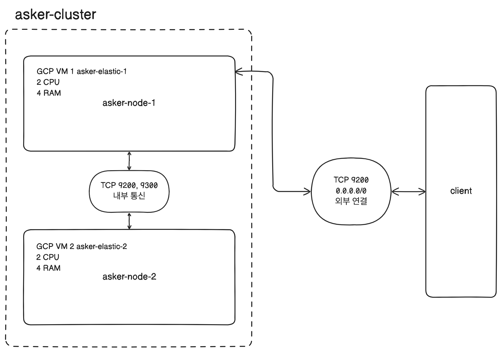
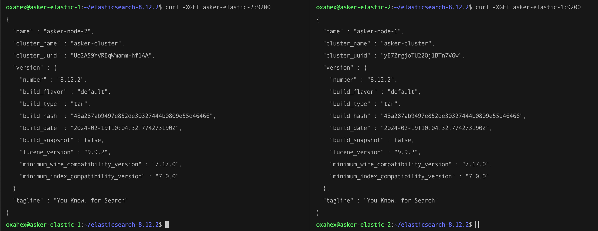

개인 프로젝트 Asker에 검색 기능을 추가하고 싶어서 ElasticSearch를 도입하기로 했다.

내가 프로젝트에 적용하고 싶은 ES 구조는 아래와 같다.

각 노드를 다른 물리 서버에 하나씩 구성하고, 이를 하나의 클러스터로 묶는다.

GCP에 asker-elastic-1, asker-elastic-2라는 2개의 인스턴스를 띄우고, ES 프로세스를 띄운다. 사실 개인 프로젝트라 2개의 노드를 하나의 클러스터로 묶지 않아도 CPU 2에 RAM 4 스펙의 인스턴스를 사용하므로 하나의 노드만 사용해도 무방하지만 역시 개인 프로젝트이기 때문에 GCP 무료 크레딧이 허용하는 안에서 이렇게 구성을 해보고 싶었다.


## 인스턴스 생성 및 ES 설치
GCP에서 E2 VM 인스턴스를 하나 생성해 SSH로 접속해 ElasticSearch와 Kibana 파일을 다운받고 압축을 풀어 두었다.
E2 인스턴스는 Ubuntu로 20GB를 할당해 생성했고, ElasticSearch와 Kibana는 모두 8.12.2 버전이다.

ElasticSearch 디렉토리 하위 `/bin` 디렉토리에는 ES 실행 파일, Certification 생성 파일, Plugin 설치 파일 등 실행 파일이 있다.

`/bin/elasticsearch` 실행 시 ES가 구동된다. 구동되면서 로그를 확인할 수 있는데, 한 줄씩 읽어보니 꽤 많은 정보를 알 수 있어서 재밌었다.

```text
[2024-03-18T06:14:31,330][INFO ][o.e.n.Node               ] [asker-elastic-1] JVM home [/home/oxahex/elasticsearch-8.12.2/jdk], using bundled JDK [true]
```

JDK를 따로 설치하지 않았지만 ES 파일 내에 `/jdk` 폴더가 있었고, 이걸 기본값으로 사용한다. 번들 JDK를 사용한다는 로그가 있었다. 이후에는 JVM 관련 환경 변수에 대한 정보가 출력됐다.

이후 모듈이 로드 되고, 노드에 대한 정보가 출력된다.

```text
[2024-03-18T06:14:42,753][INFO ][o.e.n.Node               ] [asker-elastic-1] node name [asker-elastic-1], node ID [B3x5Mk9sS2GaKxEcqXEMEw], cluster name [elasticsearch], roles [data_content, data_warm, master, remote_cluster_client, data, data_cold, ingest, data_frozen, ml, data_hot, transform]
```

아무것도 설정하지 않은 상태에서 기본으로 지정된 노드 이름은 asker-elastic-1이다. 내가 생성한 GCP VM 인스턴스 이름과 동일하다. 그리고 클러스터 이름은 elasticsearch로 지정되어 있는데, 기본적으로 ES는 노드를 하나만 생성하더라도 클러스터로 구동된다는 것을 알 수 있었다.

```text
[2024-03-18T06:15:01,810][INFO ][o.e.t.TransportService   ] [asker-elastic-1] publish_address {127.0.0.1:9300}, bound_addresses {[::1]:9300}, {127.0.0.1:9300}
```

9300번 포트를 사용한다는 의미의 로그도 볼 수 있었다.

```text
[2024-03-18T06:15:02,034][INFO ][o.e.c.c.ClusterBootstrapService] [asker-elastic-1] this node has not joined a bootstrapped cluster yet; [cluster.initial_master_nodes] is set to [asker-elastic-1]
[2024-03-18T06:15:02,043][INFO ][o.e.c.c.Coordinator      ] [asker-elastic-1] setting initial configuration to VotingConfiguration{B3x5Mk9sS2GaKxEcqXEMEw}
[2024-03-18T06:15:02,338][INFO ][o.e.c.s.MasterService    ] [asker-elastic-1] elected-as-master ([1] nodes joined in term 1)[_FINISH_ELECTION_, {asker-elastic-1}{B3x5Mk9sS2GaKxEcqXEMEw}{vYUC8n-GRuqBhh3DhJqkdw}{asker-elastic-1}{127.0.0.1}{127.0.0.1:9300}{cdfhilmrstw}{8.12.2}{7000099-8500010} completing election], term: 1, version: 1, delta: master node changed {previous [], current [{asker-elastic-1}{B3x5Mk9sS2GaKxEcqXEMEw}{vYUC8n-GRuqBhh3DhJqkdw}{asker-elastic-1}{127.0.0.1}{127.0.0.1:9300}{cdfhilmrstw}{8.12.2}{7000099-8500010}]}
[2024-03-18T06:15:02,390][INFO ][o.e.c.c.CoordinationState] [asker-elastic-1] cluster UUID set to [yE7ZrgjoTU22Oj1BTn7VGw]
[2024-03-18T06:15:02,435][INFO ][o.e.c.s.ClusterApplierService] [asker-elastic-1] master node changed {previous [], current [{asker-elastic-1}{B3x5Mk9sS2GaKxEcqXEMEw}{vYUC8n-GRuqBhh3DhJqkdw}{asker-elastic-1}{127.0.0.1}{127.0.0.1:9300}{cdfhilmrstw}{8.12.2}{7000099-8500010}]}, term: 1, version: 1, reason: Publication{term=1, version=1}
```

그리고 생성된 asker-elastic-1이 마스터 노드로 지정된다는 내용의 로그도 있었다.

```text
[2024-03-18T06:15:02,542][INFO ][o.e.h.AbstractHttpServerTransport] [asker-elastic-1] publish_address {10.178.0.2:9200}, bound_addresses {[::]:9200}
[2024-03-18T06:15:02,550][INFO ][o.e.c.c.NodeJoinExecutor ] [asker-elastic-1] node-join: [{asker-elastic-1}{B3x5Mk9sS2GaKxEcqXEMEw}{vYUC8n-GRuqBhh3DhJqkdw}{asker-elastic-1}{127.0.0.1}{127.0.0.1:9300}{cdfhilmrstw}{8.12.2}{7000099-8500010}] with reason [completing election]
[2024-03-18T06:15:02,577][INFO ][o.e.n.Node               ] [asker-elastic-1] started {asker-elastic-1}{B3x5Mk9sS2GaKxEcqXEMEw}{vYUC8n-GRuqBhh3DhJqkdw}{asker-elastic-1}{127.0.0.1}{127.0.0.1:9300}{cdfhilmrstw}{8.12.2}{7000099-8500010}{xpack.installed=true, transform.config_version=10.0.0, ml.machine_memory=4098568192, ml.allocated_processors=2, ml.allocated_processors_double=2.0, ml.max_jvm_size=2051014656, ml.config_version=12.0.0}
```

그리고 9200번 포트 연결 관련 로그가 뜨는데, 아까 9300번 포트 관련 로그는 TransportService에서, 9200번 관련 로그는 AbstractHttpServerTransport에서 찍혔다. 그 이후 node-join이라는 로그, 선출이 완료되었다는 로그가 출력됐다. 그 다음 asker-elastic-1 노드가 started 되었다는 로그가 찍힌다.

ES의 노드들은 클라이언트 통신을 위한 HTTP 포트(9200 ~ 9299), 노드 간 데이터 교환을 위한 TCP 포트(9300 ~ 9399) 총 두 개의 네트워크 통신을 열어둔다. 일반적으로 물리 서버 1개 당 하나의 노드를 실행하는 것을 권장하고 있다고 한다. 만약 하나의 물리 서버 내에서 여러 개의 노드를 실행한다면 각 노드들은 차례대로 9200, 9201 순서로 포트를 점유한다.


## 기본 설정
`/config` 디렉토리 하위에 `elasticsearch.yml` 파일에서 구동할 ES의 전반적인 설정을 수정할 수 있다.

### 클러스터 이름과 노드 이름
우선 클러스터 이름과 실행할 노드 이름을 변경했다.

```yml
# ---------------------------------- Cluster -----------------------------------
#
# Use a descriptive name for your cluster:
#
cluster.name: "asker-es-cluster"
#
# ------------------------------------ Node ------------------------------------
#
# Use a descriptive name for the node:
#
node.name: "asker-1"
```


### 네트워크
네트워크 부분은 `network.host` 설정을 통해 외부에서 접근할 수 있도록 할 수 있다. 다만 디폴트인 루프백이 아닌 실제 IP 주소로 변경하는 경우 ES 실행 시 부트스트랩 체크를 시작하게 된다.
`http.port`에는 클라이언트와 통신하는 기본 포트인 9200번이 기본값으로 설정되어 있는데, 이 포트는 well-known 포트이므로 보통 운영 환경에서는 다른 포트로 변경해서 쓰는 것이 좀 더 나을 것 같다는 생각이 든다.

```yml
# ---------------------------------- Network -----------------------------------
#
# By default Elasticsearch is only accessible on localhost. Set a different
# address here to expose this node on the network:
#
#network.host: 192.168.0.1
#
# By default Elasticsearch listens for HTTP traffic on the first free port it
# finds starting at 9200. Set a specific HTTP port here:
#
#http.port: 9200
#
# For more information, consult the network module documentation.
```


### 디스커버리
`discovery.seed_hosts`는 클러스터 구성 시 사용된다. 바인딩할 원격 노드의 IP나 도메인 주소를 배열 형태로 입력하는데 호스트만 적는 경우 9300에서 9305 사이의 포트값을 검색한다. 만약 TCP 포트가 이 범위 바깥에 설정되어 있는 경우에는 포트번호까지 적어주어야 한다. 원격에 존재하는 노드를 찾아 바인딩하는 과정을 디스커버리라고 한다.

`cluster.initial_master_nodes`는 클러스터 최초 실행 시 여기에 명시된 노드를 대상으로 마스터 노드를 선출하게 된다.

```yml
# --------------------------------- Discovery ----------------------------------
#
# Pass an initial list of hosts to perform discovery when this node is started:
# The default list of hosts is ["127.0.0.1", "[::1]"]
#
#discovery.seed_hosts: ["host1", "host2"]
#
# Bootstrap the cluster using an initial set of master-eligible nodes:
#
#cluster.initial_master_nodes: ["node-1", "node-2"]
#
# For more information, consult the discovery and cluster formation module documentation.
```

내가 설정한 노드의 이름은 node-1 이므로 그대로 두었다.

설정을 저장하고 ES를 다시 구동하니 내가 설정한대로 클러스터 이름은 asker-es-cluster, 노드 이름은 node-1으로 설정되었음을 로그로 확인할 수 있었다.

```text
[2024-03-18T08:01:23,820][INFO ][o.e.n.Node               ] [node-1] node name [node-1], node ID [B3x5Mk9sS2GaKxEcqXEMEw], cluster name [asker-es-cluster], roles [ingest, data_frozen, ml, data_hot, transform, data_content, data_warm, master, remote_cluster_client, data, data_cold]
```


> ES를 구동하고, 종료하는 명령어를 좀 더 편하게 사용하기 위해 스크립트를 작성했다.
> ES 실행 시 백그라운드로 실행하도록 하고, p 옵션을 줘서 ES가 실행되는 프로세스의 아이디를 파일로 생성하도록 설정하면 종료 시에 이 파일을 읽어 해당 프로세스를 종료하면 좀 더 편하게 ES를 구동하고 종료할 수 있을 것이다.
>
> ```shell
> /bin/elasticsearch -d -p es.pid
> ```
>
> ```shell
> kill `cat es.pid`
> ```


## 바인딩
ES의 노드가 하나의 클러스터로 관리되는 것을 바인딩이라고 한다. 각 노드가 하나의 클러스터로 바인딩 되기 위해서는 각 노드의 클러스터 이름이 동일해야 한다. 클러스터 이름이 다르면 같은 물리 서버에 존재하는 노드라도 다른 클러스터로 동작해 별개의 시스템으로 인식된다.

노드가 처음 실행될 때 같은 서버, 또는 `discovery.seed_hosts`에 설정된 주소를 순서대로 확인해 노드가 존재하는지 확인한다. 노드가 존재한다면 `cluster.name`을 확인하고, 일치하는 경우 같은 클러스터로 바인딩한다. 일치하지 않으면 다음 주소를 확인한다. 해당 호스트에 노드가 없다면 역시 다음 주소를 확인한다. 만약 모든 호스트를 스캔했으나 노드를 찾지 못한 경우 새로운 클러스터로 자기 자신(노드)을 시작한다.

- `/etc/security/limits.conf` 파일 하단에 `oxahex	-	nofile	65535`로 변경
- `/etc/sysctl.conf` 파일에 `vm.max_map_count=262144`로 변경
- `elasticsearch.yml` 파일 내에서 `cluster.initial_master_nodes: ["asker-elastic-1"]` 설정 변경

9200 포트를 여는 GCP 방화벽 규칙 asker-elastic을 새로 생성하고, 이를 asker-elastic-1 인스턴스에 적용.

asker-elastic-1과 asker-elastic-2 인스턴스의 `/etc/hosts` 파일에 호스트 이름을 명시함.

```shell
10.178.0.2 asker-elastic-1
10.178.0.3 asker-elastic-2
```

현재 asker-elastic-1은 9200번 포트를 외부에 열어두었으므로 asker-elastic-2에서 curl로 접근하면 연결된다. 하지만 asker-elastic-1에서 askerr-elastic-2로 접근 시 연결이 거부된다. 각 노드간 통신을 할 수 있도록 TCP 9200, 9300 포트를 열도록 elastic-internal 방화벽을 추가로 구성했다.

필터를 IP가 아니라 소스 태그로 적용해 asker-elastic-internal 태그를 가진 리소스간 통신을 열었다. 따라서 현재 각 인스턴스에 적용된 네트워크 설정은 다음과 같다.

- asker-elastic-1: asker-elastic, asker-elastic-internal
- asker-elastic-2: asker-elastic-internal

즉, asker-elastic-2는 외부에서 접근이 불가능하고, 클라이언트와의 모든 통신은 asker-elastic-1 인스턴스가 담당한다.



각 VM Instance의 `elasticsearch.yml` 파일의 변경점은 다음과 같다.

```yml
# asker-elastic-1 VM Instance
# elasticsearch.yml

cluster.name: "asker-cluster"
node.name: "asker-node-1"
network.host: ["_local_","_site_"]
discovery.seed_hosts: ["asker-elastic-1", "asker-elastic-2"]
cluster.initial_master_nodes: ["asker-node-1", "asker-node-2"]
```

```yml
# asker-elastic-2 VM Instance
# elasticsearch.yml

cluster.name: "asker-cluster"
node.name: "asker-node-2"
network.host: ["_local_","_site_"]
discovery.seed_hosts: ["asker-elastic-1", "asker-elastic-2"]
cluster.initial_master_nodes: ["asker-node-1", "asker-node-2"]
```

두 인스턴스에서 각각 동작하는 노드의 `cluster.name`을 동일하게 지정해 하나의 클러스터로 묶고, `discovery.seed_hosts`에 호스트를 명시했다. `cluster.initial_master_nodes`에 두 노드를 모두 명시했다.

각각의 서버에서 ES를 구동하면 로그에서 master node 선출 결과를 확인할 수 있다.

```text
// asker-elastic-1 VM Instance
[2024-03-20T10:44:15,544][INFO ][o.e.c.s.MasterService    ] [asker-node-1] elected-as-master ([2] nodes joined in term 1)[_FINISH_ELECTION_, {asker-node-2}{sRFneyzUTLe9vD0AMeaGcw}{VD9vVmCdSBeiDDsYUmAKDw}{asker-node-2}{10.178.0.3}{10.178.0.3:9300}{cdfhilmrstw}{8.12.2}{7000099-8500010} completing election, {asker-node-1}{dP6-6cQ6SYa-QVZWcfs9gA}{HHX5DOMUQne0O1ndvGjXAw}{asker-node-1}{10.178.0.2}{10.178.0.2:9300}{cdfhilmrstw}{8.12.2}{7000099-8500010} completing election], term: 1, version: 1, delta: master node changed {previous [], current [{asker-node-1}{dP6-6cQ6SYa-QVZWcfs9gA}{HHX5DOMUQne0O1ndvGjXAw}{asker-node-1}{10.178.0.2}{10.178.0.2:9300}{cdfhilmrstw}{8.12.2}{7000099-8500010}]}, added {{asker-node-2}{sRFneyzUTLe9vD0AMeaGcw}{VD9vVmCdSBeiDDsYUmAKDw}{asker-node-2}{10.178.0.3}{10.178.0.3:9300}{cdfhilmrstw}{8.12.2}{7000099-8500010}}
```

```text
// asker-elastic-2 VM Instance
[2024-03-20T10:44:15,670][INFO ][o.e.c.s.ClusterApplierService] [asker-node-2] master node changed {previous [], current [{asker-node-1}{dP6-6cQ6SYa-QVZWcfs9gA}{HHX5DOMUQne0O1ndvGjXAw}{asker-node-1}{10.178.0.2}{10.178.0.2:9300}{cdfhilmrstw}{8.12.2}{7000099-8500010}]}, added {{asker-node-1}{dP6-6cQ6SYa-QVZWcfs9gA}{HHX5DOMUQne0O1ndvGjXAw}{asker-node-1}{10.178.0.2}{10.178.0.2:9300}{cdfhilmrstw}{8.12.2}{7000099-8500010}}, term: 1, version: 1, reason: ApplyCommitRequest{term=1, version=1, sourceNode={asker-node-1}{dP6-6cQ6SYa-QVZWcfs9gA}{HHX5DOMUQne0O1ndvGjXAw}{asker-node-1}{10.178.0.2}{10.178.0.2:9300}{cdfhilmrstw}{8.12.2}{7000099-8500010}{ml.machine_memory=4098584576, transform.config_version=10.0.0, xpack.installed=true, ml.config_version=12.0.0, ml.max_jvm_size=2051014656, ml.allocated_processors_double=2.0, ml.allocated_processors=2}}
```

두 노드가 하나의 클러스터로 병합되면서 asker-node-1이 마스터 노드로 선출되었다.
VM Instance 외부에서 현재 9200번 포트가 열려 있는 인스턴스로 현재 노드를 조회해보면 모두 하나의 클러스터로 묶였고, 현재 마스터 노드로 지정된 노드는 asker-node-1임을 확인할 수 있다.

```shell
oxahex ~ % curl -XGET "34.64.84.94:9200/_cat/nodes?v"
ip         heap.percent ram.percent cpu load_1m load_5m load_15m node.role   master name
10.178.0.2           10          80   0    0.00    0.08     0.10 cdfhilmrstw *      asker-node-1
10.178.0.3           16          82   0    0.00    0.03     0.06 cdfhilmrstw -      asker-node-2
```

