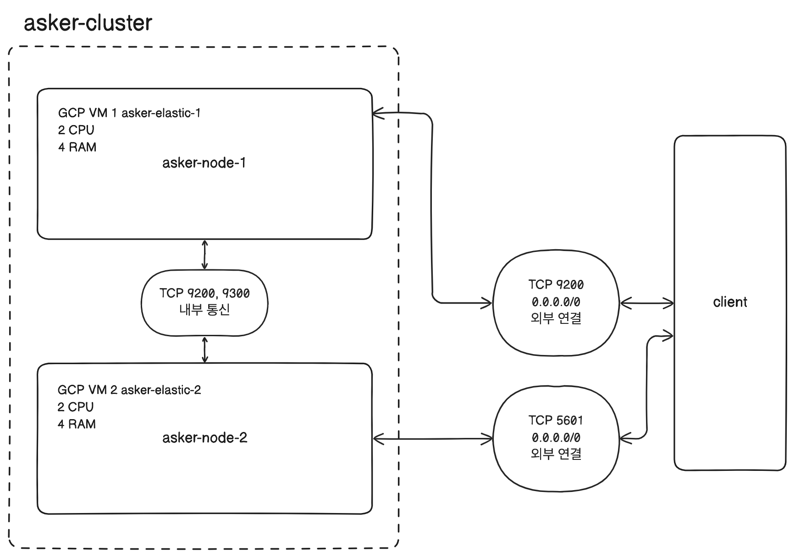

개인 프로젝트 Asker에 검색 기능을 추가하고 싶어서 ElasticSearch를 도입하기로 했다.

내가 프로젝트에 적용하고 싶은 ES 구조는 아래와 같다.

각 노드를 다른 물리 서버에 하나씩 구성하고, 이를 하나의 클러스터로 묶는다.

GCP에 asker-elastic-1, asker-elastic-2라는 2개의 인스턴스를 띄우고, ES 프로세스를 띄운다. 사실 개인 프로젝트라 2개의 노드를 하나의 클러스터로 묶지 않아도 CPU 2에 RAM 4 스펙의 인스턴스를 사용하므로 하나의 노드만 사용해도 무방하지만 역시 개인 프로젝트이기 때문에 GCP 무료 크레딧이 허용하는 안에서 이렇게 구성을 해보고 싶었다.


## 인스턴스 생성 및 ES 설치
GCP에서 E2 VM 인스턴스를 하나 생성해 SSH로 접속해 ElasticSearch와 Kibana 파일을 다운받고 압축을 풀어 두었다.
E2 인스턴스는 Ubuntu로 20GB를 할당해 생성했고, ElasticSearch와 Kibana는 모두 8.12.2 버전이다.

ElasticSearch 디렉토리 하위 `/bin` 디렉토리에는 ES 실행 파일, Certification 생성 파일, Plugin 설치 파일 등 실행 파일이 있다.

`/bin/elasticsearch` 실행 시 ES가 구동된다. 구동되면서 로그를 확인할 수 있는데, 한 줄씩 읽어보니 꽤 많은 정보를 알 수 있어서 재밌었다.

```text
[2024-03-18T06:14:31,330][INFO ][o.e.n.Node               ] [asker-elastic-1] JVM home [/home/oxahex/elasticsearch-8.12.2/jdk], using bundled JDK [true]
```

JDK를 따로 설치하지 않았지만 ES 파일 내에 `/jdk` 폴더가 있었고, 이걸 기본값으로 사용한다. 번들 JDK를 사용한다는 로그가 있었다. 이후에는 JVM 관련 환경 변수에 대한 정보가 출력됐다.

이후 모듈이 로드 되고, 노드에 대한 정보가 출력된다.

```text
[2024-03-18T06:14:42,753][INFO ][o.e.n.Node               ] [asker-elastic-1] node name [asker-elastic-1], node ID [B3x5Mk9sS2GaKxEcqXEMEw], cluster name [elasticsearch], roles [data_content, data_warm, master, remote_cluster_client, data, data_cold, ingest, data_frozen, ml, data_hot, transform]
```

아무것도 설정하지 않은 상태에서 기본으로 지정된 노드 이름은 asker-elastic-1이다. 내가 생성한 GCP VM 인스턴스 이름과 동일하다. 그리고 클러스터 이름은 elasticsearch로 지정되어 있는데, 기본적으로 ES는 노드를 하나만 생성하더라도 클러스터로 구동된다는 것을 알 수 있었다.

```text
[2024-03-18T06:15:01,810][INFO ][o.e.t.TransportService   ] [asker-elastic-1] publish_address {127.0.0.1:9300}, bound_addresses {[::1]:9300}, {127.0.0.1:9300}
```

9300번 포트를 사용한다는 의미의 로그도 볼 수 있었다.

```text
[2024-03-18T06:15:02,034][INFO ][o.e.c.c.ClusterBootstrapService] [asker-elastic-1] this node has not joined a bootstrapped cluster yet; [cluster.initial_master_nodes] is set to [asker-elastic-1]
[2024-03-18T06:15:02,043][INFO ][o.e.c.c.Coordinator      ] [asker-elastic-1] setting initial configuration to VotingConfiguration{B3x5Mk9sS2GaKxEcqXEMEw}
[2024-03-18T06:15:02,338][INFO ][o.e.c.s.MasterService    ] [asker-elastic-1] elected-as-master ([1] nodes joined in term 1)[_FINISH_ELECTION_, {asker-elastic-1}{B3x5Mk9sS2GaKxEcqXEMEw}{vYUC8n-GRuqBhh3DhJqkdw}{asker-elastic-1}{127.0.0.1}{127.0.0.1:9300}{cdfhilmrstw}{8.12.2}{7000099-8500010} completing election], term: 1, version: 1, delta: master node changed {previous [], current [{asker-elastic-1}{B3x5Mk9sS2GaKxEcqXEMEw}{vYUC8n-GRuqBhh3DhJqkdw}{asker-elastic-1}{127.0.0.1}{127.0.0.1:9300}{cdfhilmrstw}{8.12.2}{7000099-8500010}]}
[2024-03-18T06:15:02,390][INFO ][o.e.c.c.CoordinationState] [asker-elastic-1] cluster UUID set to [yE7ZrgjoTU22Oj1BTn7VGw]
[2024-03-18T06:15:02,435][INFO ][o.e.c.s.ClusterApplierService] [asker-elastic-1] master node changed {previous [], current [{asker-elastic-1}{B3x5Mk9sS2GaKxEcqXEMEw}{vYUC8n-GRuqBhh3DhJqkdw}{asker-elastic-1}{127.0.0.1}{127.0.0.1:9300}{cdfhilmrstw}{8.12.2}{7000099-8500010}]}, term: 1, version: 1, reason: Publication{term=1, version=1}
```

그리고 생성된 asker-elastic-1이 마스터 노드로 지정된다는 내용의 로그도 있었다.

```text
[2024-03-18T06:15:02,542][INFO ][o.e.h.AbstractHttpServerTransport] [asker-elastic-1] publish_address {10.178.0.2:9200}, bound_addresses {[::]:9200}
[2024-03-18T06:15:02,550][INFO ][o.e.c.c.NodeJoinExecutor ] [asker-elastic-1] node-join: [{asker-elastic-1}{B3x5Mk9sS2GaKxEcqXEMEw}{vYUC8n-GRuqBhh3DhJqkdw}{asker-elastic-1}{127.0.0.1}{127.0.0.1:9300}{cdfhilmrstw}{8.12.2}{7000099-8500010}] with reason [completing election]
[2024-03-18T06:15:02,577][INFO ][o.e.n.Node               ] [asker-elastic-1] started {asker-elastic-1}{B3x5Mk9sS2GaKxEcqXEMEw}{vYUC8n-GRuqBhh3DhJqkdw}{asker-elastic-1}{127.0.0.1}{127.0.0.1:9300}{cdfhilmrstw}{8.12.2}{7000099-8500010}{xpack.installed=true, transform.config_version=10.0.0, ml.machine_memory=4098568192, ml.allocated_processors=2, ml.allocated_processors_double=2.0, ml.max_jvm_size=2051014656, ml.config_version=12.0.0}
```

그리고 9200번 포트 연결 관련 로그가 뜨는데, 아까 9300번 포트 관련 로그는 TransportService에서, 9200번 관련 로그는 AbstractHttpServerTransport에서 찍혔다. 그 이후 node-join이라는 로그, 선출이 완료되었다는 로그가 출력됐다. 그 다음 asker-elastic-1 노드가 started 되었다는 로그가 찍힌다.

ES의 노드들은 클라이언트 통신을 위한 HTTP 포트(9200 ~ 9299), 노드 간 데이터 교환을 위한 TCP 포트(9300 ~ 9399) 총 두 개의 네트워크 통신을 열어둔다. 일반적으로 물리 서버 1개 당 하나의 노드를 실행하는 것을 권장하고 있다고 한다. 만약 하나의 물리 서버 내에서 여러 개의 노드를 실행한다면 각 노드들은 차례대로 9200, 9201 순서로 포트를 점유한다.


## 기본 설정
`/config` 디렉토리 하위에 `elasticsearch.yml` 파일에서 구동할 ES의 전반적인 설정을 수정할 수 있다.

### 클러스터 이름과 노드 이름
우선 클러스터 이름과 실행할 노드 이름을 변경했다.

```yml
# ---------------------------------- Cluster -----------------------------------
#
# Use a descriptive name for your cluster:
#
cluster.name: "asker-es-cluster"
#
# ------------------------------------ Node ------------------------------------
#
# Use a descriptive name for the node:
#
node.name: "asker-1"
```


### 네트워크
네트워크 부분은 `network.host` 설정을 통해 외부에서 접근할 수 있도록 할 수 있다. 다만 디폴트인 루프백이 아닌 실제 IP 주소로 변경하는 경우 ES 실행 시 부트스트랩 체크를 시작하게 된다.
`http.port`에는 클라이언트와 통신하는 기본 포트인 9200번이 기본값으로 설정되어 있는데, 이 포트는 well-known 포트이므로 보통 운영 환경에서는 다른 포트로 변경해서 쓰는 것이 좀 더 나을 것 같다는 생각이 든다.

```yml
# ---------------------------------- Network -----------------------------------
#
# By default Elasticsearch is only accessible on localhost. Set a different
# address here to expose this node on the network:
#
#network.host: 192.168.0.1
#
# By default Elasticsearch listens for HTTP traffic on the first free port it
# finds starting at 9200. Set a specific HTTP port here:
#
#http.port: 9200
#
# For more information, consult the network module documentation.
```


### 디스커버리
`discovery.seed_hosts`는 클러스터 구성 시 사용된다. 바인딩할 원격 노드의 IP나 도메인 주소를 배열 형태로 입력하는데 호스트만 적는 경우 9300에서 9305 사이의 포트값을 검색한다. 만약 TCP 포트가 이 범위 바깥에 설정되어 있는 경우에는 포트번호까지 적어주어야 한다. 원격에 존재하는 노드를 찾아 바인딩하는 과정을 디스커버리라고 한다.

`cluster.initial_master_nodes`는 클러스터 최초 실행 시 여기에 명시된 노드를 대상으로 마스터 노드를 선출하게 된다.

```yml
# --------------------------------- Discovery ----------------------------------
#
# Pass an initial list of hosts to perform discovery when this node is started:
# The default list of hosts is ["127.0.0.1", "[::1]"]
#
#discovery.seed_hosts: ["host1", "host2"]
#
# Bootstrap the cluster using an initial set of master-eligible nodes:
#
#cluster.initial_master_nodes: ["node-1", "node-2"]
#
# For more information, consult the discovery and cluster formation module documentation.
```

내가 설정한 노드의 이름은 node-1 이므로 그대로 두었다.

설정을 저장하고 ES를 다시 구동하니 내가 설정한대로 클러스터 이름은 asker-es-cluster, 노드 이름은 node-1으로 설정되었음을 로그로 확인할 수 있었다.

```text
[2024-03-18T08:01:23,820][INFO ][o.e.n.Node               ] [node-1] node name [node-1], node ID [B3x5Mk9sS2GaKxEcqXEMEw], cluster name [asker-es-cluster], roles [ingest, data_frozen, ml, data_hot, transform, data_content, data_warm, master, remote_cluster_client, data, data_cold]
```


> ES를 구동하고, 종료하는 명령어를 좀 더 편하게 사용하기 위해 스크립트를 작성했다.
> ES 실행 시 백그라운드로 실행하도록 하고, p 옵션을 줘서 ES가 실행되는 프로세스의 아이디를 파일로 생성하도록 설정하면 종료 시에 이 파일을 읽어 해당 프로세스를 종료하면 좀 더 편하게 ES를 구동하고 종료할 수 있을 것이다.
>
> ```shell
> /bin/elasticsearch -d -p es.pid
> ```
>
> ```shell
> kill `cat es.pid`
> ```


## 바인딩
ES의 노드가 하나의 클러스터로 관리되는 것을 바인딩이라고 한다. 각 노드가 하나의 클러스터로 바인딩 되기 위해서는 각 노드의 클러스터 이름이 동일해야 한다. 클러스터 이름이 다르면 같은 물리 서버에 존재하는 노드라도 다른 클러스터로 동작해 별개의 시스템으로 인식된다.

노드가 처음 실행될 때 같은 서버, 또는 `discovery.seed_hosts`에 설정된 주소를 순서대로 확인해 노드가 존재하는지 확인한다. 노드가 존재한다면 `cluster.name`을 확인하고, 일치하는 경우 같은 클러스터로 바인딩한다. 일치하지 않으면 다음 주소를 확인한다. 해당 호스트에 노드가 없다면 역시 다음 주소를 확인한다. 만약 모든 호스트를 스캔했으나 노드를 찾지 못한 경우 새로운 클러스터로 자기 자신(노드)을 시작한다.


### 부트스트랩
하나의 인스턴스에서 루프백으로 노드에 질의하는 경우에는 별다른 설정이 필요 없지만 host를 실제 IP 주소나 `_site_`로 설정해 인스턴스의 주소를 가리키도록 설정 한 이후에는 부트스트랩 검사가 수행된다.

부트스트랩 검사 시 체크해야 하는 목록과 에러 메세지를 참고해 필요한 설정을 변경했다.
[Bootstrap Checks | Elasticsearch Guide \[8.12\] | Elastic](https://www.elastic.co/guide/en/elasticsearch/reference/8.12/bootstrap-checks.html)

- `/etc/security/limits.conf` 파일 하단에 `oxahex	-	nofile	65535`로 변경
- `/etc/sysctl.conf` 파일에 `vm.max_map_count=262144`로 변경

### 외부 연결
9200 포트를 여는 GCP 방화벽 규칙 asker-elastic을 새로 생성하고, 이를 asker-elastic-1 인스턴스에 적용했다.
asker-elastic-1과 asker-elastic-2 인스턴스의 `/etc/hosts` 파일에 호스트 이름을 명시해 해당 host 이름으로 요청이 가능하도록 설정했다.

```shell
10.178.0.2 asker-elastic-1
10.178.0.3 asker-elastic-2
```

현재 asker-elastic-1은 9200번 포트를 외부에 열어두었으므로 asker-elastic-2에서 curl로 접근하면 연결된다. 하지만 asker-elastic-1에서 askerr-elastic-2로 접근 시 연결이 거부된다. 각 노드간 통신을 할 수 있도록 TCP 9200, 9300 포트를 열도록 elastic-internal 방화벽을 추가로 구성했다.

필터를 IP가 아니라 소스 태그로 적용해 asker-elastic-internal 태그를 가진 리소스간 통신을 열었다. 따라서 현재 각 인스턴스에 적용된 네트워크 설정은 다음과 같다.

- asker-elastic-1: asker-elastic, asker-elastic-internal
- asker-elastic-2: asker-elastic-internal

즉, asker-elastic-2는 외부에서 접근이 불가능하고, 클라이언트와의 모든 통신은 asker-elastic-1 인스턴스가 담당한다. 각 인스턴스에 asker-elastic-internal 태그를 달아 9200, 9300 포트로 통신이 가능하도록 설정했다. 따라서 아래 사진과 같이 상호 호출이 가능하다.


### ES 설정
각 VM Instance의 `elasticsearch.yml` 파일의 변경점은 다음과 같다.

```yml
# asker-elastic-1 VM Instance
# elasticsearch.yml

cluster.name: "asker-cluster"
node.name: "asker-node-1"
network.host: ["_local_","_site_"]
discovery.seed_hosts: ["asker-elastic-1", "asker-elastic-2"]
cluster.initial_master_nodes: ["asker-node-1", "asker-node-2"]
```

```yml
# asker-elastic-2 VM Instance
# elasticsearch.yml

cluster.name: "asker-cluster"
node.name: "asker-node-2"
network.host: ["_local_","_site_"]
discovery.seed_hosts: ["asker-elastic-1", "asker-elastic-2"]
cluster.initial_master_nodes: ["asker-node-1", "asker-node-2"]
```

두 인스턴스에서 각각 동작하는 노드의 `cluster.name`을 동일하게 지정해 하나의 클러스터로 묶고, `discovery.seed_hosts`에 호스트를 명시했다. `cluster.initial_master_nodes`에 두 노드를 모두 명시했다.

각각의 서버에서 ES를 구동하면 로그에서 master node 선출 결과를 확인할 수 있다.

```text
// asker-elastic-1 VM Instance
[2024-03-20T10:44:15,544][INFO ][o.e.c.s.MasterService    ] [asker-node-1] elected-as-master ([2] nodes joined in term 1)[_FINISH_ELECTION_, {asker-node-2}{sRFneyzUTLe9vD0AMeaGcw}{VD9vVmCdSBeiDDsYUmAKDw}{asker-node-2}{10.178.0.3}{10.178.0.3:9300}{cdfhilmrstw}{8.12.2}{7000099-8500010} completing election, {asker-node-1}{dP6-6cQ6SYa-QVZWcfs9gA}{HHX5DOMUQne0O1ndvGjXAw}{asker-node-1}{10.178.0.2}{10.178.0.2:9300}{cdfhilmrstw}{8.12.2}{7000099-8500010} completing election], term: 1, version: 1, delta: master node changed {previous [], current [{asker-node-1}{dP6-6cQ6SYa-QVZWcfs9gA}{HHX5DOMUQne0O1ndvGjXAw}{asker-node-1}{10.178.0.2}{10.178.0.2:9300}{cdfhilmrstw}{8.12.2}{7000099-8500010}]}, added {{asker-node-2}{sRFneyzUTLe9vD0AMeaGcw}{VD9vVmCdSBeiDDsYUmAKDw}{asker-node-2}{10.178.0.3}{10.178.0.3:9300}{cdfhilmrstw}{8.12.2}{7000099-8500010}}
```

```text
// asker-elastic-2 VM Instance
[2024-03-20T10:44:15,670][INFO ][o.e.c.s.ClusterApplierService] [asker-node-2] master node changed {previous [], current [{asker-node-1}{dP6-6cQ6SYa-QVZWcfs9gA}{HHX5DOMUQne0O1ndvGjXAw}{asker-node-1}{10.178.0.2}{10.178.0.2:9300}{cdfhilmrstw}{8.12.2}{7000099-8500010}]}, added {{asker-node-1}{dP6-6cQ6SYa-QVZWcfs9gA}{HHX5DOMUQne0O1ndvGjXAw}{asker-node-1}{10.178.0.2}{10.178.0.2:9300}{cdfhilmrstw}{8.12.2}{7000099-8500010}}, term: 1, version: 1, reason: ApplyCommitRequest{term=1, version=1, sourceNode={asker-node-1}{dP6-6cQ6SYa-QVZWcfs9gA}{HHX5DOMUQne0O1ndvGjXAw}{asker-node-1}{10.178.0.2}{10.178.0.2:9300}{cdfhilmrstw}{8.12.2}{7000099-8500010}{ml.machine_memory=4098584576, transform.config_version=10.0.0, xpack.installed=true, ml.config_version=12.0.0, ml.max_jvm_size=2051014656, ml.allocated_processors_double=2.0, ml.allocated_processors=2}}
```

두 노드가 하나의 클러스터로 병합되면서 asker-node-1이 마스터 노드로 선출되었다.
VM Instance 외부에서 현재 9200번 포트가 열려 있는 인스턴스로 현재 노드를 조회해보면 모두 하나의 클러스터로 묶였고, 현재 마스터 노드로 지정된 노드는 asker-node-1임을 확인할 수 있다.

```shell
oxahex ~ % curl -XGET "34.64.84.94:9200/_cat/nodes?v"
ip         heap.percent ram.percent cpu load_1m load_5m load_15m node.role   master name
10.178.0.2           10          80   0    0.00    0.08     0.10 cdfhilmrstw *      asker-node-1
10.178.0.3           16          82   0    0.00    0.03     0.06 cdfhilmrstw -      asker-node-2
```


## 기본 보안 적용
`xpack.security.enabled` 설정을 `false`로 해두고 클러스터를 구성했다. 우선 두 개의 노드가 하나의 클러스터로 묶이는 것을 빠르게 확인해보고 싶었기 때문이다. 하지만 현재는 노드 간 통신에 SSL이 적용되어 있지 않고, 외부에 공개된 IP로 누구나 요청을 보낼 수 있다. 따라서 기본적인 보안을 위해 두 가지 설정을 추가로 적용해야 한다.
[Set up basic security](https://www.elastic.co/guide/en/elasticsearch/reference/8.12/security-basic-setup.html)

첫 번째는 요청을 할 수 있는 유저를 제한하는 것이고, 두 번째는 노드 간 통신에 TLS를 적용하는 것이다. 운영 모드로 ES를 구동하려면 부트스트랩이 수행된다. 이 과정에서 여러 개의 노드를 하나의 클러스터로 묶어서 구동하려면 SSL을 적용해야 한다.

따라서 ID, Password 설정 이전에 TLS를 먼저 적용하고, 이후 ID, Password를 설정했다.

### 노드 간 통신에 TLS 적용
[Set up basic security for the Elastic Stack | Elasticsearch Guide \[8.12\] | Elastic](https://www.elastic.co/guide/en/elasticsearch/reference/8.12/security-basic-setup.html#generate-certificates)
`elasticsearch.yml` 파일에서 보안 관련 설정을 하는 부분은 다음과 같다.

```yml
# Enable security features
xpack.security.enabled: true

xpack.security.enrollment.enabled: true

# Enable encryption for HTTP API client connections, such as Kibana, Logstash, and Agents
xpack.security.http.ssl:
  enabled: true
  keystore.path: certs/http.p12

# Enable encryption and mutual authentication between cluster nodes
xpack.security.transport.ssl:
  enabled: true
  verification_mode: certificate
  keystore.path: certs/transport.p12
  truststore.path: certs/transport.p12
```

공개 키와 보안 키를 생성하고, 키의 위치를 파일에 명시해야 한다.

ES에서는 Certificate Authority를 생성할 수 있는 유틸을 제공한다.
```shell
./bin/elasticsearch-certutil ca
```

기본값으로 `elastic-stack-ca.p12`라는 파일에 CA의 공개 인증서와 각 노드의 인증서에 서명하는 데 사용되는 개인 키(공개 키)가 포함된다. 이후 이 키를 이용해 대칭 키를 만든다. `elasticsearch.yml` 파일의 기본 값에 key path가 cert 디렉토리 하위에 있으므로 대칭 키 생성 시 디렉토리를 생성하고, 하위에 만들기로 했다.

공개 키 파일과 대칭 키 파일 이름을 커스텀해서 생성했고, 이 파일의 경로를 `elasticsearch.yml` 파일에 명시했다.
이후 ES를 구동하기 위해 `secure_password`를 명시해 주어야 하는데, 이 설정은 secure setting이고, ElasticSearch keystone 내에 저장되어 있어야 한다. 그냥 `elasticsearch.yml` 파일에 스트링으로 명시하면 IllegalArgumentException이 발생한다.

당연히 패스워드는 보이지 않는 곳에 저장을 해야 하므로 ES에서는 keystore 유틸을 제공한다. 유틸을 사용해 `keystore.secured_password`, `truststore.secured_password`를 모두 설정했다. 이 부분도 공식 문서에 잘 나와 있었다.

ES는 정상적으로 구동 되었다. 이제 asker-node-2에서도 같은 대칭 키를 사용할 수 있도록 해야 한다. 파일 전송 프로토콜인 scp를 이용해 해당 파일을 asker-elastic-2 VM Instance의 동일한 위치에 전송했다. 마찬가지로 `elasticsearch.yml` 파일의 보안 설정을 수정하고, keystore에 두 secured password를 저장했다.

이후부터는 두 노드가 내부적으로 통신할 때 보안이 적용된 프로토콜로 통신을 하게 된다.


### Password 설정
이후부터는 외부에서 ES로 쿼리할 때 ID, Password를 포함해 요청을 보내야 한다. ES에서 패스워드를 설정할 수 있는 유틸을 제공한다.
[Built-in users | Elasticsearch Guide \[8.12\] | Elastic](https://www.elastic.co/guide/en/elasticsearch/reference/8.12/built-in-users.html#set-built-in-user-passwords)

```shell
oxahex@asker-elastic-1~$ ./bin/elasticsearch-setup-passwords
Sets the passwords for reserved users

Non-option arguments:
command

Option             Description
------             -----------
-E <KeyValuePair>  Configure a setting
-h, --help         Show help
-s, --silent       Show minimal output
-v, --verbose      Show verbose output

ERROR: Missing required command, with exit code 64

Commands
--------
auto - Uses randomly generated passwords
interactive - Uses passwords entered by a user
```

두 가지 옵션을 줄 수 있는데, auto 옵션은 패스워드를 자동 생성하고, interactive 옵션은 유저가 직접 입력하는 방식이다.
만약 auto 옵션으로 패스워드를 생성하게 되면 주요 시스템의 ID와 Password를 한 번에 세팅하게 되는데, 이를 잊어버리면 다시 생성할 수 없다. data 디렉토리를 날리고 다시 셋업해야 한다. 아니면 `/bin/elasticsearch-users` 유틸을 사용해 유저를 추가하는 방법도 있긴 하다.

> **Native Realm**
> `elasticsearch-setup-password` 유틸을 이용해 주요 패스워드를 설정한다.
> `_security/role`, `_security/user`와 같은 REST API를 이용해서 사용자와 롤을 추가하거나 삭제할 수 있다.
> Kibana의 사용자와 롤 설정 UI도 이 API를 사용한다.
> 클러스터 상태 정보 영역에 저장되기 때문에 어떤 노드에서든 실행하면 클러스터로 묶인 모든 노드에서 사용이 가능하다.
>
> **File Realm**
> `elasticsearch-users` 유틸을 이용해 사용자의 롤을 추가하고 삭제할 수 있다.
> `config/` 디렉토리 하위의 `users`, `users_roles` 파일을 수정해서 추가 또는 삭제가 가능하다.
> 파일 기반이므로 설정한 노드에서만 유효하다.

interactive로 패스워드를 설정하고 외부에서 ES로 요청했을 때 기대했던 응답을 받을 수 있었다.

```text
~ % curl 34.64.84.94:9200 -u elastic
Enter host password for user 'elastic':
{
  "name" : "asker-node-1",
  "cluster_name" : "asker-cluster",
  "cluster_uuid" : "H3WgHjaHR1C7wmxYNTwGgw",
  "version" : {
    "number" : "8.12.2",
    "build_flavor" : "default",
    "build_type" : "tar",
    "build_hash" : "48a287ab9497e852de30327444b0809e55d46466",
    "build_date" : "2024-02-19T10:04:32.774273190Z",
    "build_snapshot" : false,
    "lucene_version" : "9.9.2",
    "minimum_wire_compatibility_version" : "7.17.0",
    "minimum_index_compatibility_version" : "7.0.0"
  },
  "tagline" : "You Know, for Search"
}
```


## Kibana
이후 개발 시 편의를 위해 Kibana를 연동했다. Kibana가 포함된 구조도는 아래와 같다.



Kibana의 기본 포트는 5601번이므로 기본 포트를 외부에 오픈하도록 처리하고, Kibana 서버는 asker-elastic-2 VM Instance에서 구동되도록 했다.

### 기본 설정
Kibana 역시 기본적인 설정은 `/config/kibana.yml` 에서 설정한다.

```yml
# /config/kibana.yml
server.host: "asker-elastic-2"
server.name: "asker-kibana"
elasticsearch.hosts: ["http://asker-elastic-2:9200"]
```

포트와 같은 다른 설정은 그대로 두었고, 현재 내가 원하는 구조에서 Kibana는 asker-elastic-2 인스턴스에서 asker-node-2와 같이 구동된다. `server.host`에는 Kibana가 구동될 서버 인스턴스의 호스트를 지정했다. 이전에 `hosts` 파일에 IP 주소를 매핑해 두었다.

`elasticsearch.hosts`는 Kibana가 연결될 ES가 구동되고 있는 인스턴스 호스트를 의미한다. 만약 Kibana를 다른 인스턴스에 분리해서 구동 시켰다면 해당 인스턴스의 호스트가 필요하지만, 내가 원하는 구조에서는 같은 인스턴스에서 구동되므로 위와 같이 설정해두었다.

그 외에 찾아봤던 설정은 `kibana.index`다. Kibana는 Kibana의 설정을 ES에 저장한다. 그 때 이 설정값을 저장할 ES 인덱스를 지정할 수 있다. 만약 ES에 여러 개의 Kibana 서버를 연동하려는 경우 인덱스를 다르게 하면 각각의 설정값을 다른 인덱스에 저장해 충돌을 방지할 수 있다.

이전에 ES 클러스터를 구성할 때 보안 설정을 하면서 지정했던 패스워드를 Kibana에서 알고 있어야 인스턴스로 쿼리할 수 있다. 따라서 `elasticsearch.username`과 `elasticsearch.password` 설정도 필요한데, ES와 같이 Kibana도 keystore를 제공한다. keystore를 생성하고 `elasticsearch.password` 값을 저장한 다음 `./bin/kibana-keystore list`로 keystore에 저장된 목록을 확인할 수 있다.

GCP VPC 방화벽을 추가로 생성해 5601번 포트를 열어 asker-elastic-2 VM Instance에 적용했다. asker-elastic-2의 퍼블릭 IP의 5610번 포트로 접속하면 Kibana 로그인 화면이 뜨는 것을 확인할 수 있다.


