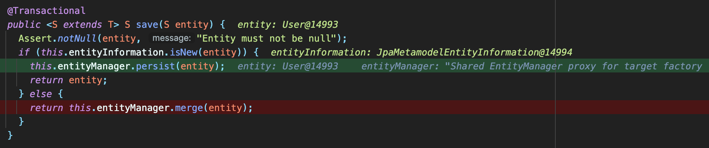
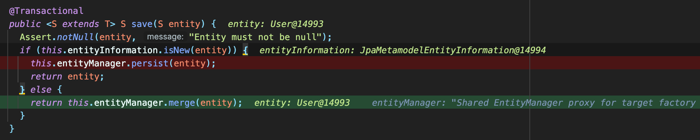
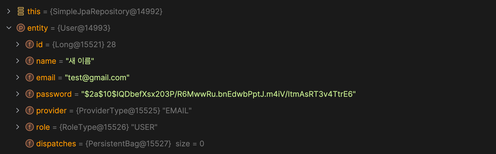

일반적으로 Spring Data JPA를 사용해 Repository를 Interface로 만들고 메서드 쿼리를 사용한다면 `save()`, `findById()`와 같이 메서드 이름으로 원하는 쿼리를 만들어낼 수 있다. Interface만으로 동작할 수 없으므로 `save()`, `findById()`와 같은 기본 메서드를 구현하는 구현체가 있을 것이다. 이 구현체의 동작 방식을 코드 레벨에서 확인해보면 내가 정확히 알지 못하고 사용하던 메서드를 조금 더 깊게 이해할 수 있을 것 같아 확인해보기로 했다.

```java
@Repository
@Transactional(readOnly = true)
public class SimpleJpaRepository<T, ID> implements JpaRepositoryImplementation<T, ID> {
  private static final String ID_MUST_NOT_BE_NULL = "The given id must not be null";
  private final JpaEntityInformation<T, ?> entityInformation;
  private final EntityManager entityManager;
  private final PersistenceProvider provider;
  @Nullable
  private CrudMethodMetadata metadata;
  private EscapeCharacter escapeCharacter;

  public SimpleJpaRepository(JpaEntityInformation<T, ?> entityInformation, EntityManager entityManager) {
    this.escapeCharacter = EscapeCharacter.DEFAULT;
    Assert.notNull(entityInformation, "JpaEntityInformation must not be null");
    Assert.notNull(entityManager, "EntityManager must not be null");
    this.entityInformation = entityInformation;
    this.entityManager = entityManager;
    this.provider = PersistenceProvider.fromEntityManager(entityManager);
  }

  public SimpleJpaRepository(Class<T> domainClass, EntityManager entityManager) {
    this(JpaEntityInformationSupport.getEntityInformation(domainClass, entityManager), entityManager);
  }

  // ...
}
```

JpaRepository Interface의 구현체는 SimpleJpaRepository다.

가장 먼저 눈에 띄는 것은 어노테이션이다. `@Repository`와, `@Transactional` 어노테이션이 붙어 있다. 여기에서 알 수 있는 것은 SimpleJpaRepository 클래스는 컴포넌트 스캔 대상이고, 서버 구동 시 Spring Bean으로 등록된다는 것이다. 그리고 JPA의 모든 메서드는 하나의 트랜잭션에서 동작한다는 것이다.

## @Transactional
가장 먼저 눈에 띄는 것은 어노테이션이다. `@Repository`와, `@Transactional` 어노테이션이 붙어 있다. 여기에서 알 수 있는 것은 SimpleJpaRepository 클래스는 컴포넌트 스캔 대상이고, 서버 구동 시 Spring Bean으로 등록된다는 것이다. 그리고 JPA의 모든 메서드는 하나의 트랜잭션에서 동작한다는 것이다.

### 서비스 계층의 모든 메서드에 @Transactional 어노테이션을 붙이는 것은
처음 Spring 프레임워크를 배웠을 때, 많은 강의나 내가 찾아본 자료에서 서비스 계층의 클래스나, 메서드 레벨에 `@Transaction` 어노테이션을 붙이는 것을 봤다. 그 때는 ‘어노테이션을 붙인 메서드는 하나의 트랜잭션 내에서 동작하는구나’ 정도로 이해하고 넘어갔다. 그래서 클래스 레벨에 `@Transaction(readOnly = true)` 어노테이션을 붙이고, 데이터 변경이 일어나는 메서드에서는 메서드 레벨에 `@Transactional`을 붙였다.

아래는 내가 과거에 작성했던 코드다. 메서드 내에서 하는 작업은 단순히 회원가입 DTO에서 데이터를 꺼내 User Entity로 변환하고 `save()` 메서드를 사용해 DB에 저장하는 것이다.

```java
@Transactional
public JoinResDto createUser(JoinReqDto joinReqDto) {

 log.info("[유저 생성][email={}]", joinReqDto.getEmail());

 User user = userRepository.save(User.builder()
   .name(joinReqDto.getName())
   .email(joinReqDto.getEmail())
   .password(passwordEncoder.encode(joinReqDto.getPassword()))
   .role(RoleType.USER)
   .providerType((ProviderType.EMAIL))
   .build());

 return new JoinResDto(user);
}
```

그렇다면 `createUser()` 메서드 상단에 붙인 `@Transactional` 어노테이션은 의미가 있는 어노테이션일까? 과거의 나는 이 메서드가 하나의 트랜잭션 안에서 동작하기를 바래서 `@Transactional` 어노테이션을 붙였다.

트랜잭션 어노테이션을 제거했을 때의 로그를 확인해보면 다음과 같다.

```text
o.asker.server.service.AuthService       : [유저 생성][email=test@gmail.com]
o.s.orm.jpa.JpaTransactionManager        : Creating new transaction with name [org.springframework.data.jpa.repository.support.SimpleJpaRepository.save]: PROPAGATION_REQUIRED,ISOLATION_DEFAULT
o.s.orm.jpa.JpaTransactionManager        : Opened new EntityManager [SessionImpl(1669257390<open>)] for JPA transaction
o.s.orm.jpa.JpaTransactionManager        : Exposing JPA transaction as JDBC [org.springframework.orm.jpa.vendor.HibernateJpaDialect$HibernateConnectionHandle@7d4ab42d]
Hibernate:
    /* insert for
        oxahex.asker.server.domain.user.User */insert
    into
        user (created_at, email, modified_at, name, password, provider, role)
    values
        (?, ?, ?, ?, ?, ?, ?)
o.s.orm.jpa.JpaTransactionManager        : Initiating transaction commit
o.s.orm.jpa.JpaTransactionManager        : Committing JPA transaction on EntityManager [SessionImpl(1669257390<open>)]
o.s.orm.jpa.JpaTransactionManager        : Closing JPA EntityManager [SessionImpl(1669257390<open>)] after transaction
```

1. AuthService 클래스의 `createUser()` 메서드에 진입한다.
2. SimpleJpaRepository의 save에서 PROPAGATION_REQUIRED, ISOLATION_DEFAULT로 트랜잭션이 생성된다.
3. EntityManager를 통해 트랜잭션이 시작되고, DB에 INSERT 쿼리가 나간다.
4. 트랜잭션이 커밋된다.


트랜잭션 어노테이션을 붙였을 때 로그를 확인해보면 다음과 같다.

```text
o.s.orm.jpa.JpaTransactionManager        : Creating new transaction with name [oxahex.asker.server.service.AuthService.createUser]: PROPAGATION_REQUIRED,ISOLATION_DEFAULT
o.s.orm.jpa.JpaTransactionManager        : Opened new EntityManager [SessionImpl(818368256<open>)] for JPA transaction
o.s.orm.jpa.JpaTransactionManager        : Exposing JPA transaction as JDBC [org.springframework.orm.jpa.vendor.HibernateJpaDialect$HibernateConnectionHandle@34f8ddc0]
o.asker.server.service.AuthService       : [유저 생성][email=test@gmail.com]
o.s.orm.jpa.JpaTransactionManager        : Found thread-bound EntityManager [SessionImpl(818368256<open>)] for JPA transaction
o.s.orm.jpa.JpaTransactionManager        : Participating in existing transaction
Hibernate:
    /* insert for
        oxahex.asker.server.domain.user.User */insert
    into
        user (created_at, email, modified_at, name, password, provider, role)
    values
        (?, ?, ?, ?, ?, ?, ?)
o.s.orm.jpa.JpaTransactionManager        : Initiating transaction commit
o.s.orm.jpa.JpaTransactionManager        : Committing JPA transaction on EntityManager [SessionImpl(818368256<open>)]
o.s.orm.jpa.JpaTransactionManager        : Closing JPA EntityManager [SessionImpl(818368256<open>)] after transaction
```

1. AuthService 클래스의 `createUser()` 메서드에 트랜잭션 어노테이션이 있으므로 트랜잭션을 생성한다. 이 과정에서 `createUser()` 메서드는 프록시를 통해 동작하게 된다.
2. EntityManager를 통해 트랜잭션이 시작되고 `save()` 메서드가 호출될 때 기존의 트랜잭션에 참여한다는 로그가 찍힌다.
3. DB에 INSERT 쿼리가 나간다.
4. 트랜잭션이 커밋된다.

`@Transactional` 어노테이션이 있기 때문에 `createUser()` 메서드는 프록시 객체를 통해 호출된다. 즉, `createUser()` 트랜잭션이 생성되고, `save()` 메서드는 기존의 트랜잭션에 참여하는 형태가 된다.

`createUser()` 메서드에서 유저 Entity를 생성하고 `save()` 메서드를 호출해 DB에 저장하기만 한다면 사실 `createUser()` 메서드 레벨에서 `@Transactional` 어노테이션을 붙이지 않아도 동일하게 동작한다. 메서드 내부에서 트랜잭션이 필요한 작업은 DB에 유저를 저장하는 부분 뿐이고, 그 이외에 다른 작업을 하지 않기 때문이다.

만약 `createUser()` 메서드 내에서 `save()` 메서드를 호출해 유저를 저장하는 작업 외에 다른 작업이 필요하고, 메서드 내의 모든 트랜잭션이 하나의 트랜잭션으로 동작하기를 원한다면 `@Transactional` 어노테이션이 필요할 것이다.

### Persistence Context
물론 SimpleJpaRepository 클래스 내 메서드에서 기본적으로 지원하는 트랜잭션만 사용하면 서비스 계층의 메서드에서는 영속성 컨텍스트의 이점을 누릴 수 없다. `save()` 메서드 호출 시 트랜잭션이 시작되고, DB에 데이터를 INSERT 하고 나면 트랜잭션이 종료된다. 트랜잭션이 커밋되는 시점에 영속성 컨텍스트 역시 초기화되기 때문에 Dirty Checking이나 1차 캐시 등의 이점은 사용할 수 없다.

즉, 아래와 같이 새로운 유저 데이터를 DB에 저장하는 로직 이후에 `user.changeName()` 메서드를 이용해 이름을 변경하는 경우 `@Transactional` 어노테이션이 메서드 레벨이 붙어있는 경우 다시 `save()` 메서드로 저장하지 않아도 변경된 이름이 DB에 저장된다.

```java
@Transactional
 public JoinResDto createUser(JoinReqDto joinReqDto) {

  log.info("[유저 생성][email={}]", joinReqDto.getEmail());

  User user = userRepository.save(User.builder()
    .name(joinReqDto.getName())
    .email(joinReqDto.getEmail())
    .password(passwordEncoder.encode(joinReqDto.getPassword()))
    .role(RoleType.USER)
    .providerType((ProviderType.EMAIL))
    .build());

  user.changeName("새로운 이름");

  return new JoinResDto(user);
 }
```

로그를 보면 이렇다.

```text
o.s.orm.jpa.JpaTransactionManager        : Creating new transaction with name [oxahex.asker.server.service.AuthService.createUser]: PROPAGATION_REQUIRED,ISOLATION_DEFAULT
o.s.orm.jpa.JpaTransactionManager        : Opened new EntityManager [SessionImpl(137230741<open>)] for JPA transaction
o.s.orm.jpa.JpaTransactionManager        : Exposing JPA transaction as JDBC [org.springframework.orm.jpa.vendor.HibernateJpaDialect$HibernateConnectionHandle@6df58a4c]
o.asker.server.service.AuthService       : [유저 생성][email=test@gmail.com]
o.s.orm.jpa.JpaTransactionManager        : Found thread-bound EntityManager [SessionImpl(137230741<open>)] for JPA transaction
o.s.orm.jpa.JpaTransactionManager        : Participating in existing transaction
Hibernate:
    /* insert for
        oxahex.asker.server.domain.user.User */insert
    into
        user (created_at, email, modified_at, name, password, provider, role)
    values
        (?, ?, ?, ?, ?, ?, ?)
o.s.orm.jpa.JpaTransactionManager        : Initiating transaction commit
o.s.orm.jpa.JpaTransactionManager        : Committing JPA transaction on EntityManager [SessionImpl(137230741<open>)]
Hibernate:
    /* update
        for oxahex.asker.server.domain.user.User */update user
    set
        created_at=?,
        email=?,
        modified_at=?,
        name=?,
        password=?,
        provider=?,
        role=?
    where
        user_id=?
o.s.orm.jpa.JpaTransactionManager        : Closing JPA EntityManager [SessionImpl(137230741<open>)] after transaction
```

`save()` 메서드의 트랜잭션은 `createUser()` 메서드에 참여하고 있는 형태이고, 따라서 전체 트랜잭션을 종료할 권한은 `createUser()` 메서드에서 시작된 트랜잭션이 가지고 있다. `save()` 메서드는 내부적으로 `em.persist()` 메서드를 통해 데이터를 DB에 저장한다. 데이터를 `persist()` 한다는 것은 해당 객체를 영속성 컨텍스트에 저장한다는 것이다. 따라서 1차 캐시에 유저의 초기 데이터가 저장되어 있다. `save()` 메서드의 트랜잭션은 전체 트랜잭션을 종료 할 수 없고, 따라서 `createUser()` 메서드가 종료되기 전까지는 영속성 컨텍스트가 유효하므로 `changeName()`으로 영속성 컨텍스트에 저장된 Entity의 데이터가 변경되었을 때, 이를 감지해  전체 트랜잭션이 종료될 때 UPDATE 쿼리가 나가게 된다.

그렇다면 `createUser()` 메서드에 `@Transatcional` 어노테이션이 없다면 어떻게 동작할까? 예상되는 것은 객체가 변경되고, 이를 DTO로 만들어 컨트롤러 계층으로 반환하므로 API의 응답은 아래와 같을 것이다.

```json
{
    "message": "회원 가입이 완료되었습니다.",
    "data": {
        "name": "새로운 이름",
        "email": "test@gmail.com",
        "role": "USER"
    }
}
```

그러나 실제 로그를 확인해보면 UPDATE 쿼리가 나가지 않을 것이고, DB에는 변경 전 이름으로 유저 데이터가 저장되어 있을 것이다.

```text
o.a.server.controller.AuthController     : [회원가입 요청][email=test@gmail.com]
o.asker.server.service.AuthService       : [유저 생성][email=test@gmail.com]
o.s.orm.jpa.JpaTransactionManager        : Creating new transaction with name [org.springframework.data.jpa.repository.support.SimpleJpaRepository.save]: PROPAGATION_REQUIRED,ISOLATION_DEFAULT
o.s.orm.jpa.JpaTransactionManager        : Opened new EntityManager [SessionImpl(74068826<open>)] for JPA transaction
o.s.orm.jpa.JpaTransactionManager        : Exposing JPA transaction as JDBC [org.springframework.orm.jpa.vendor.HibernateJpaDialect$HibernateConnectionHandle@55a70f]
Hibernate:
    /* insert for
        oxahex.asker.server.domain.user.User */insert
    into
        user (created_at, email, modified_at, name, password, provider, role)
    values
        (?, ?, ?, ?, ?, ?, ?)
o.s.orm.jpa.JpaTransactionManager        : Initiating transaction commit
o.s.orm.jpa.JpaTransactionManager        : Committing JPA transaction on EntityManager [SessionImpl(74068826<open>)]
o.s.orm.jpa.JpaTransactionManager        : Closing JPA EntityManager [SessionImpl(74068826<open>)] after transaction
```

예상했던 대로 UPDATE 쿼리는 나가지 않았다.

따라서 서비스 계층의 모든 메서드에 `@Transactional` 어노테이션을 붙이는 것이 과연 의미가 있는 것인지 생각해볼 필요가 있다. 내부 동작을 잘 몰랐을 때는 기계적으로 붙였고, 정상 동작하므로 별다른 생각을 하지 않았다. 하지만 내부 구현을 확인해보니 모든 메서드 레벨에 트랜잭션 어노테이션을 붙이면 불필요하게 많은 트랜잭션이 생성되고, 하위 트랜잭션이 참여하는 형태가 되지 않을까? 하는 생각이 들었다.


## 기본 제공 메서드 분석
그 다음으로는 SimpleJpaRepository 구현체는 내부적으로 EntityManager를 사용해서 각 메서드의 실질적인 동작을 정의하고 있다. 이를 통해 JPA는 내부적으로 JDBC를 사용해 각각의 동작을 구현하고 있음을 알 수 있었다.

그동안 JPA의 기본 제공 메서드를 사용하며 궁금한 점이 있었다.

1. `save()` 메서드는 Entity를 새로 저장하고, 수정하는 역할을 모두 제공한다. 이게 어떻게 가능할까?
2. `findById()`와 `getReferenceById()`는 어떻게 다를까?
3. `delete()`와 `deleteById()`는 어떻게 다를까?

구현체의 메서드 동작을 확인해보면 차이를 알 수 있지 않을까?

### `save()`

#### 데이터 생성과 수정을 구분하는 방법

`save()` 메서드는 Entity를 저장하는 경우, 수정하는 경우 모두 사용할 수 있다.

```java
@Transactional
public <S extends T> S save(S entity) {
  Assert.notNull(entity, "Entity must not be null");
  if (this.entityInformation.isNew(entity)) {
    this.entityManager.persist(entity);
    return entity;
  } else {
    return this.entityManager.merge(entity);
  }
}
```

메서드를 확인해보니 구현 자체는 단순했다. `this.entityInformation.isNew(entity)` 로 파라미터로 받은 Entity가 새로운 Entity라면 `persist()`를 호출해 INSERT 하고, 새로운 Entity가 아닌 경우에는 `merge()`를 호출해 UPDATE 한다.

그렇다면 Entity가 새로 생성되는 Entity인지 어떻게 판단할까?

`save()` 메서드를 호출해 Entity를 저장하면 `this.entityInformation.isNew()` 메서드가 호출된다. JpaEntityInformation은 Interface이고, 실제로 호출되는 구현체는 JpaMetamodelEntityInformation 클래스다. 이 클래스의 `isNew()` 메서드는 다음과 같다.

```java
public boolean isNew(T entity) {
  if (!this.versionAttribute.isEmpty() && !(Boolean)this.versionAttribute.map(Attribute::getJavaType).map(Class::isPrimitive).orElse(false)) {
    BeanWrapper wrapper = new DirectFieldAccessFallbackBeanWrapper(entity);
    return (Boolean)this.versionAttribute.map((it) -> {
      return wrapper.getPropertyValue(it.getName()) == null;
    }).orElse(true);
  } else {
    return super.isNew(entity);
  }
}
```

조건문을 확인해보면 1차적으로 Entity의 버전 관련 속성이 있는지 확인하고, 이를 만족하지 않으면 `super.isNew()`를 호출해 상위 추상 클래스인 AbstractEntityInformation의 `isNew()` 메서드를 호출한다.

```java
public boolean isNew(T entity) {
  ID id = this.getId(entity);
  Class<ID> idType = this.getIdType();
  if (!idType.isPrimitive()) {
    return id == null;
  } else if (id instanceof Number) {
    return ((Number)id).longValue() == 0L;
  } else {
    throw new IllegalArgumentException(String.format("Unsupported primitive id type %s", idType));
  }
}
```

여기에서는 Entity의 id 값을 확인한다. 재미있는 부분은 이 id 값이 primitive 타입인지 확인한다는 것이다. 만약 Entity의 id 필드가 Long 타입이라면 null이 들어갈 수 있고, long 타입이라면 primitive 타입이므로 null이 들어갈 수 없다. 따라서 이 메서드에서는 id의 값이 타입에 따라 null 또는 0L일 때 true를 반환한다.

생각해보면 id는 Entity 생성 시점에 임의로 정의하는 것이 아니다.

```java
public class User {

 @Id
 @GeneratedValue(strategy = GenerationType.IDENTITY)
 @Column(name = "user_id")
 private Long id;

 // ...
}
```

`@GenerateValue`로 값을 생성하면 `persist()`가 호출되는 시점, 즉 Entity가 저장되는 시점에 id 값이 확정된다. 따라서 새로 저장하는 Entity는 id 값이 null이거나 0L이다. 이것을 기준으로 판단하는 거였다.

#### `persist()`와 `merge()`

그렇다면 `persist()`와 `merge()`는 내부적으로 어떻게 동작할까? 새 유저를 생성하는 메서드 내에서 `save()` 메서드를 두 번 호출했다. 첫 번째 `save()` 메서드는 새로운 유저 데이터를 DB에 INSERT 하고, 이후 유저의 이름을 변경한 다음 다시 `save()` 메서드를 호출한다. 이 때의 `save()` 메서드는 `persist()`가 아니라 `merge()`를 호출해 UPDATE 쿼리를 실행한다.

현재 `createUser()` 메서드에는 `@Transactional` 어노테이션을 붙이지 않았다. 따라서 메서드 내의 두 `save()` 메서드는 각각의 트랜잭션에서 동작한다.

```java
public JoinResDto createUser(JoinReqDto joinReqDto) {

  log.info("[유저 생성][email={}]", joinReqDto.getEmail());

  User user = userRepository.save(User.builder()
    .name(joinReqDto.getName())
    .email(joinReqDto.getEmail())
    .password(passwordEncoder.encode(joinReqDto.getPassword()))
    .role(RoleType.USER)
    .providerType((ProviderType.EMAIL))
    .build());

  user.changeName("새 이름");

  userRepository.save(user);

  return new JoinResDto(user);
 }
```

첫 번째 `save()` 메서드가 호출될 때는 Entity의 id 필드 값이 null이므로 `isNew()` 조건문에서 true가 반환되고 `persist()` 메서드가 실행된다.


두 번째 `save()` 메서드에서는 Entity의 id 필드 값이 28인 것을 확인할 수 있다. 따라서 `merge()` 메서드가 실행된다.


로그를 확인하면 어떨까?

```text
o.asker.server.service.AuthService       : [유저 생성][email=test@gmail.com]
o.s.orm.jpa.JpaTransactionManager        : Creating new transaction with name [org.springframework.data.jpa.repository.support.SimpleJpaRepository.save]: PROPAGATION_REQUIRED,ISOLATION_DEFAULT
o.s.orm.jpa.JpaTransactionManager        : Opened new EntityManager [SessionImpl(1639162546<open>)] for JPA transaction
o.s.orm.jpa.JpaTransactionManager        : Exposing JPA transaction as JDBC [org.springframework.orm.jpa.vendor.HibernateJpaDialect$HibernateConnectionHandle@d4f6c18]
Hibernate:
    /* insert for
        oxahex.asker.server.domain.user.User */insert
    into
        user (created_at, email, modified_at, name, password, provider, role)
    values
        (?, ?, ?, ?, ?, ?, ?)
o.s.orm.jpa.JpaTransactionManager        : Initiating transaction commit
o.s.orm.jpa.JpaTransactionManager        : Committing JPA transaction on EntityManager [SessionImpl(1639162546<open>)]
o.s.orm.jpa.JpaTransactionManager        : Closing JPA EntityManager [SessionImpl(1639162546<open>)] after transaction
o.s.orm.jpa.JpaTransactionManager        : Creating new transaction with name [org.springframework.data.jpa.repository.support.SimpleJpaRepository.save]: PROPAGATION_REQUIRED,ISOLATION_DEFAULT
o.s.orm.jpa.JpaTransactionManager        : Opened new EntityManager [SessionImpl(296977056<open>)] for JPA transaction
o.s.orm.jpa.JpaTransactionManager        : Exposing JPA transaction as JDBC [org.springframework.orm.jpa.vendor.HibernateJpaDialect$HibernateConnectionHandle@36800497]
com.zaxxer.hikari.pool.HikariPool        : HikariPool-1 - Thread starvation or clock leap detected (housekeeper delta=47s179ms).
Hibernate:
    select
        u1_0.user_id,
        u1_0.created_at,
        u1_0.email,
        u1_0.modified_at,
        u1_0.name,
        u1_0.password,
        u1_0.provider,
        u1_0.role
    from
        user u1_0
    where
        u1_0.user_id=?
o.s.orm.jpa.JpaTransactionManager        : Initiating transaction commit
o.s.orm.jpa.JpaTransactionManager        : Committing JPA transaction on EntityManager [SessionImpl(296977056<open>)]
Hibernate:
    /* update
        for oxahex.asker.server.domain.user.User */update user
    set
        created_at=?,
        email=?,
        modified_at=?,
        name=?,
        password=?,
        provider=?,
        role=?
    where
        user_id=?
o.s.orm.jpa.JpaTransactionManager        : Closing JPA EntityManager [SessionImpl(296977056<open>)] after transaction
```

각 `save()` 메서드 당 하나의 트랜잭션이 개별적으로 동작하는 것을 확인할 수 있다.

그런데 중요한 점은 두 번째 `save()` 메서드, 즉 `merge()`가 실행될 때 SELECT 쿼리와 UPDATE 쿼리가 나간다는 점이다. 코드를 작성하는 시점에서 기대했던 동작은 UPDATE 쿼리만 나가는 것인데 왜 SELECT 쿼리가 한 번 동작한 다음 UPDATE 쿼리가 나가는 것일까?

영속성 컨텍스트를 생각해보면 이유를 알 수 있다. `persist()` 동작을 수행하는 트랜잭션과 `merge()` 동작을 수행하는 트랜잭션은 독립적인 트랜잭션이다. 첫 번째 트랜잭션이 끝나면 유저 Entity는 영속성 컨텍스트에 존재하지 않는다. 두 번째 트랜잭션이 시작되는 시점에서는 유저 Entity의 변경을 알 수 없다. 따라서 기본적으로 `merge()`는 기본적으로 1차 캐시에 해당 데이터가 있는지 확인하고 없는 경우 SELECT 쿼리를 실행해 DB에서 데이터를 조회한다. 그리고 입력 받은 데이터를 DB에서 가져온 객체에 복사해서 갈아 끼운 뒤 INSERT 쿼리를 실행한다.

`createUser()` 메서드의 기능으로 다시 돌아가 생각해보면, 유저 Entity를 생성하고 이름을 변경한 다음 저장하는 것이 기대했던 동작이다. 따라서 두 번째 `save()` 메서드가 호출되는 시점의 유저 Entity는 사실 트랜잭션이 분리되지 않았다면 1차 캐시에 그대로 존재하는 데이터다.

이런 경우 굳이 `merge()` 메서드가 동작해 불필요한 SELECT 쿼리를 수행하게 하는 것이 나을까? 만약 이 작업이 독립적인 트랜잭션이 아니라 하나의 트랜잭션으로 묶여 있었다면 변경 감지가 일어나 SELECT 쿼리 없이도 UPDATE를 할 수 있었을 것이다.


### `findById()`와 `getReferenceById()`

`findById()`와 `getReferenceById()` 모두 Entity의 id 필드를 이용해 DB에서 데이터를 조회해 오는 메서드임은 분명하다. 그렇다면 두 메서드는 내부적으로 어떻게 동작할까?

```java
public Optional<T> findById(ID id) {
  Assert.notNull(id, "The given id must not be null");
  Class<T> domainType = this.getDomainClass();
  if (this.metadata == null) {
    return Optional.ofNullable(this.entityManager.find(domainType, id));
  } else {
    LockModeType type = this.metadata.getLockModeType();
    Map<String, Object> hints = this.getHints();
    return Optional.ofNullable(type == null ? this.entityManager.find(domainType, id, hints) : this.entityManager.find(domainType, id, type, hints));
  }
}
```

```java
public T getReferenceById(ID id) {
  Assert.notNull(id, "The given id must not be null");
  return this.entityManager.getReference(this.getDomainClass(), id);
}
```

눈에 가장 먼저 보이는 차이는 `findById()`는 내부적으로 EntityManager 구현체의 `find()` 메서드를 호출하고, `getReferenceById()`는 `getReference()`를 호출한다는 것이다. 두 메서드는 어떻게 동작할까?

아주 간단히 테스트 코드를 작성했다.

```java
@SpringBootTest
public class JpaTest {

 @Autowired
 UserRepository userRepository;

 @Test
 @DisplayName("findById")
 public void find_by_id() throws Exception {

  userRepository.findById(1L);
 }

 @Test
 @DisplayName("getReferenceById")
 public void get_reference_by_id() throws Exception {

  userRepository.getReferenceById(1L);
 }
}
```

그 결과 `findById()` 호출 시에는 SELECT 쿼리가 나가는 것을 볼 수 있었다. 반면 `getReferenceById()` 메서드 호출 시에는 트랜잭션이 생성되나 실제로 쿼리가 나가지 않는 것을 확인했다.

두 메서드 모두 반환 타입이 존재하는데, 그렇다면 각 메서드를 실행했을 때 반환된 User Entity 객체는 어떤 형태일까?

```text
// findById()
oxahex.asker.server.jpa.JpaTest          : [findById] user class=class oxahex.asker.server.domain.user.User

// getReferenceById()
oxahex.asker.server.jpa.JpaTest          : [getReferenceById] user class=class oxahex.asker.server.domain.user.User$HibernateProxy$Ut9RU27s
```

`findById()` 메서드 호출 시에는 `Optional<User>`가 존재하는 경우 내부의 User Entity는 실제 User Entity다. 반면 `getReferenceById()`를 통해 가져온 UserEntity는 프록시 객체임을 확인할 수 있었다. 즉, `getReferenceById()`는 입력한 id를 필드로 가진 프록시 객체를 생성할 뿐 DB 조회를 하지 않는다. 만약 실제 DB에 존재하지 않는 id 값으로 조회한다고 해도 해당 id를 필드로 갖는 프록시 객체가 생성된다. 존재 유무를 체크하지 않는 것이다.

`user.getId()`, `user.getName()`로 User Entity의 필드를 조회하면 `findById()`로 가져오는 경우 해당 필드에 접근할 수 있고 데이터도 존재하지만 `getReferenceById()`로 User Entity를 조회한 경우에는 id 필드의 값만 조회할 수 있고 다른 필드를 조회하는 경우 다음 예외가 발생한다.

```java
@Test
@DisplayName("getReferenceById")
public void get_reference_by_id() throws Exception {

 log.info("[getReferenceById][호출]");
 User user = userRepository.getReferenceById(1L);

 log.info("[getReferenceById] user class={}", user.getClass());

 log.info("[getReferenceById] user id={}", user.getId());
 log.info("[getReferenceById] user name={}", user.getName());

}
```

```text
org.hibernate.LazyInitializationException: could not initialize proxy [oxahex.asker.server.domain.user.User#1] - no Session
```

이유는 `getReferenceById()` 메서드는 트랜잭션 내에서 동작하지만 테스트 코드의 메서드는 트랜잭션으로 동작하지 않기 때문이다.

로그를 확인해보면 다음과 같다.

```text
o.s.orm.jpa.JpaTransactionManager        : Creating new transaction with name [oxahex.asker.server.jpa.JpaTest.get_reference_by_id]: PROPAGATION_REQUIRED,ISOLATION_DEFAULT,readOnly
o.s.orm.jpa.JpaTransactionManager        : Opened new EntityManager [SessionImpl(752520169<open>)] for JPA transaction
o.s.jdbc.datasource.DataSourceUtils      : Setting JDBC Connection [HikariProxyConnection@1965592391 wrapping com.mysql.cj.jdbc.ConnectionImpl@37753b69] read-only
o.s.orm.jpa.JpaTransactionManager        : Exposing JPA transaction as JDBC [org.springframework.orm.jpa.vendor.HibernateJpaDialect$HibernateConnectionHandle@53365a58]
oxahex.asker.server.jpa.JpaTest          : [getReferenceById][호출]
o.s.orm.jpa.JpaTransactionManager        : Found thread-bound EntityManager [SessionImpl(752520169<open>)] for JPA transaction

o.s.orm.jpa.JpaTransactionManager        : Participating in existing transaction
oxahex.asker.server.jpa.JpaTest          : [getReferenceById] user class=class oxahex.asker.server.domain.user.User$HibernateProxy$KX5s4A81
oxahex.asker.server.jpa.JpaTest          : [getReferenceById] user id=1

Hibernate:
    select
        u1_0.user_id,
        u1_0.created_at,
        u1_0.email,
        u1_0.modified_at,
        u1_0.name,
        u1_0.password,
        u1_0.provider,
        u1_0.role
    from
        user u1_0
    where
        u1_0.user_id=?
oxahex.asker.server.jpa.JpaTest          : [getReferenceById] user name=user

o.s.orm.jpa.JpaTransactionManager        : Initiating transaction rollback
o.s.orm.jpa.JpaTransactionManager        : Rolling back JPA transaction on EntityManager [SessionImpl(752520169<open>)]
o.s.jdbc.datasource.DataSourceUtils      : Resetting read-only flag of JDBC Connection [HikariProxyConnection@1965592391 wrapping com.mysql.cj.jdbc.ConnectionImpl@37753b69]
o.s.orm.jpa.JpaTransactionManager        : Closing JPA EntityManager [SessionImpl(752520169<open>)] after transaction
```

`user.getName()`을 호출하는 시점에 SELECT 쿼리가 나간다.

만약 id 값이 DB에 실제 존재하는 데이터임을 보장할 수 있다면 User Entity의 id 값을 FK로 가지는 다른 Entity를 저장해야 하는 경우 User Entity를 불필요하게 SELECT 하지 않아도 된다.


### `delete()`와 `deleteById()`

특정 유저 Entity를 삭제한다고 했을 때, `delete()` 메서드에 해당 유저 Entity를 넘겨서 삭제하는 것과 `deleteById()` 메서드에 유저 Entity의 id 필드 값을 넘겨서 삭제하는 것은 어떤 차이가 있는지 궁금했다.

`delete()` 메서드 구현부는 아래와 같다.

```java
@Transactional
public void delete(T entity) {
  Assert.notNull(entity, "Entity must not be null");
  if (!this.entityInformation.isNew(entity)) {
    Class<?> type = ProxyUtils.getUserClass(entity);
    T existing = this.entityManager.find(type, this.entityInformation.getId(entity));
    if (existing != null) {
      this.entityManager.remove(this.entityManager.contains(entity) ? entity : this.entityManager.merge(entity));
    }
  }
}
```

1. `isNew()` 메서드로 id 필드가 null 또는 0L인지 확인한다. 애초에 저장되지 않은 값을 삭제하는 것은 의미가 없으므로 당연하다.
2. `find()` 메서드로 영속성 컨텍스트에서 데이터를 조회하고, 없으면 DB에 SELET 요청을 해 데이터를 가져온다.
3. DB에 데이터가 존재하지 않았을 때 `existing == null`이 된다. 존재하지 않는 데이터는 삭제할 필요가 없으므로 이후 로직을 진행하지 않는다.
4. 실제로 DB에 존재하는 데이터라면이후 `remove()`를 호출해 DELETE 쿼리를 수행한다.
5. 재미있는 부분은 `contain()` 메서드를 호출하는 부분인데, 이 메서드를 통해 해당 Entity가 영속성 컨텍스트에 존재하는지 확인한다. 존재한다면 별다른 조치 없이 해당 Entity를 DELETE 처리하고, 존재하지 않는다면 `merge()` 메서드를 호출해 해당 Entity를 영속성 컨텍스트에 저장한 다음 DELETE 처리한다.

>궁금한 부분은 5번인데, 이미 위에서 `find()` 호출 시점에 Entity가 영속성 컨텍스트에 저장되는데, 왜 하단에서 영속성 컨텍스트 저장 여부를 다시 확인하는지 잘 모르겠다. 이 부분은 조금 더 확인이 필요해서 JPA 리포지토리에 문의를 남겨 두었다.

`deleteById()` 메서드 구현부는 아래와 같다.

```java
@Transactional
public void deleteById(ID id) {
  Assert.notNull(id, "The given id must not be null");
  this.findById(id).ifPresent(this::delete);
}
```

`findById()` 메서드로 해당 데이터를 DB에서 조회하고, 존재하는 경우 `delete()` 메서드를 사용한다.

내부 구현을 확인했을 때 `delete()`와 `deleteById()` 메서드는 동작이 거의 동일하다. 차이가 있다면 `delete()` 메서드는 이미 Entity를 들고 있다고 가정하고 Entity를 기반으로 삭제 처리를 하는 것이고 `deleteById()` 메서드는 Entity에 대해 id 필드 값만 들고 있어도 내부적으로 해당 Entity를 찾아서 삭제 처리한다.

결국 삭제를 해야 할 때 기존의 트랜잭션에서 삭제할 Entity에 별다른 작업을 해주지 않고 단순히 id만 들고 있는 상황이라면 `deleteById()` 메서드를 이용해 내부적으로 해당 Entity를 조회해 삭제하도록 하고, 기존의 트랜잭션에서 이미 삭제할 Entity가 영속성 컨텍스트에 들어가 있어서 추가로 조회할 필요가 없다면  `delete()` 메서드를 사용하는 것이 낫겠다는 생각이 들었다,

또, 삭제할 Entity가 영속성 컨텍스트에 없지만 서비스 로직 상 해당 Entity가 없을 때 따로 예외 처리를 해주어야 한다면 `findById()`는 `Optional<T>`를 반환하므로 이 시점에 커스텀한 예외를 반환하고, `delete()` 메서드를 호출해 삭제하는 것도 생각해볼 수 있을 것 같다.

