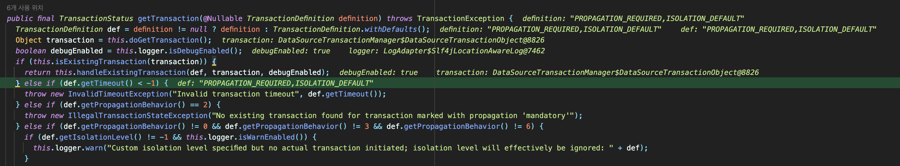
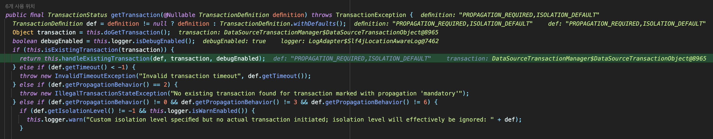
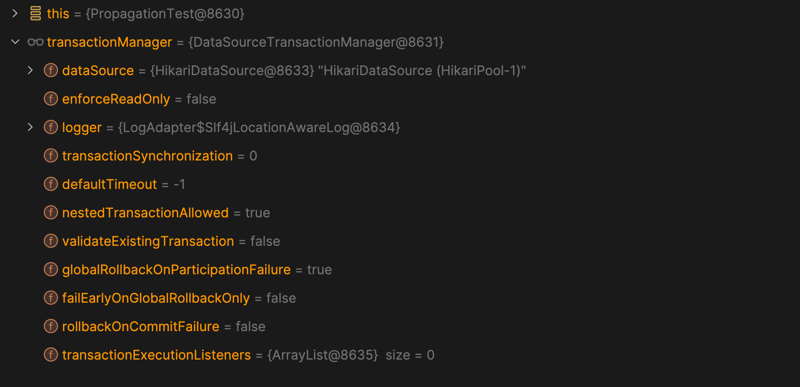
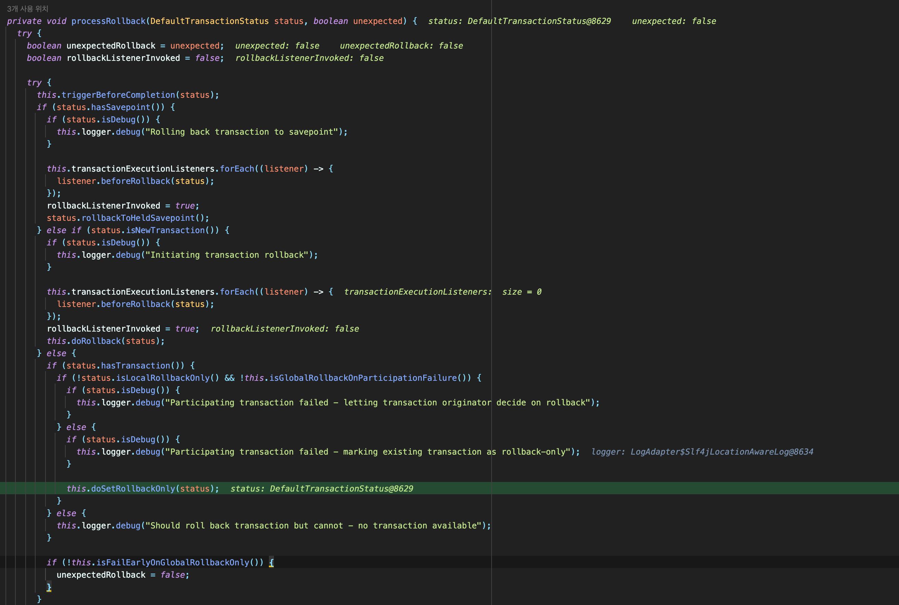
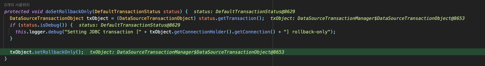
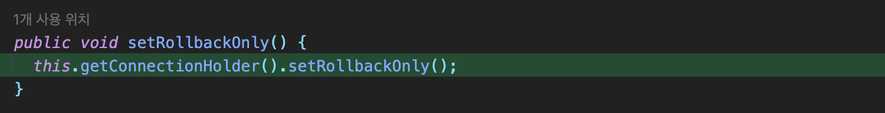
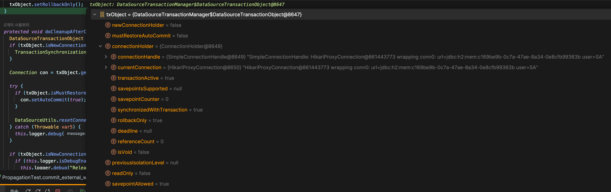
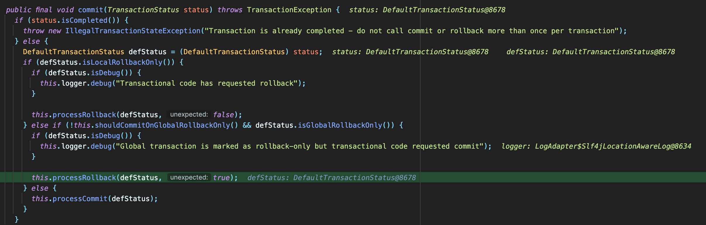
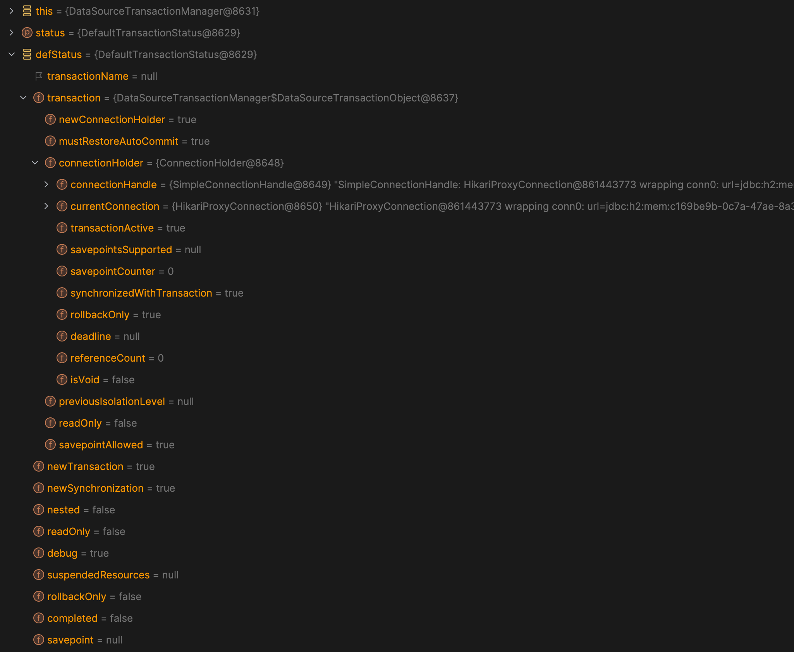
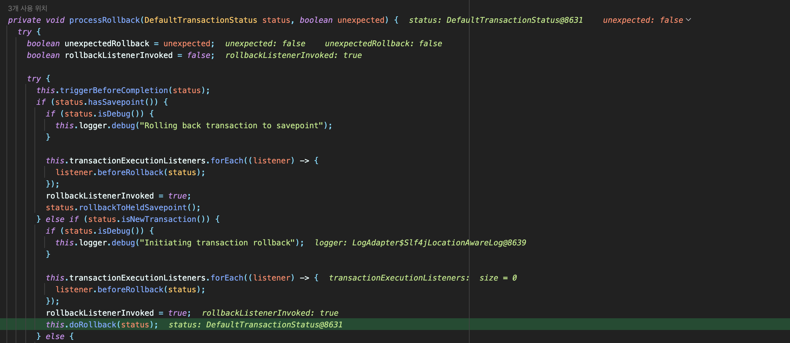

Spring이 지원하는 DB Transaction의 내부 동작 원리와 Transaction Propagation이 동작하는 방식을 파악하기 위해 디버깅을 해보며 흐름을 따라가보았다.

@Transactional 어노테이션을 클래스 레벨이나 메서드 레벨이 붙이면 Spring이 DB Transaction 관리를 알아서 해준다.

이렇게 작성하면 프레임워크가 혹은 라이브러리가 **알아서 해준다** 정도로 이해해야 하는 상황이 가장 답답하게 느껴진다. 어떻게 알아서 해준다는 것인지 따로 찾아보지 않으면 영원히 모르게 될 가능성이 높기 때문이다. 그래서 알아서 해주는 것을 확인하고 적용해본 다음에는 꼭 어떻게 알아서 해주는 것인지를 찾아봐야 마음이 놓인다.

보통은 서비스 계층의 메서드에 @Transactional 어노테이션을 붙이면 해당 메서드에 정의된 동작은 하나의 트랜잭션 안에서 이루어진다. 하나의 트랜잭션 안에서 이루어진다는 것은 요청이 해당 커넥션으로 전달되었을 때 DB 서버 내부에서 하나의 세션으로 요청을 실행한다는 뜻이다.

그렇다면 스프링은 어떻게 @Transactional 어노테이션을 붙이는 것만으로 해당 메서드를 하나의 트랜잭션 안에서 동작하도록 할 수 있는 것일까?

## @Transactional 어노테이션이 없다면
서비스 계층, 즉 주된 비즈니스 로직을 구현한 계층에서는 커넥션을 생성하고, 트랜잭션 커밋 이후에 해당 커넥션을 종료하는 작업까지가 하나의 기능이다. 하나의 트랜잭션이 동작하는 동안에는 당연히 같은 커넥션을 유지해야 하고, 작업 하나에서 생성되는 모든 SQL 요청은 같은 커넥션을 통해 동일한 DB 세션에 전달되어야 한다. 하나의 기능을 처리할 때 같은 커넥션을 유지하려면 어떻게 해야 할까?

가장 먼저 생각해볼 수 있는 것은 서비스 계층에서 비즈니스 로직을 시작할 때 커넥션을 생성하고, 데이터 계층의 메서드를 호출할 때 생성한 커넥션을 사용하도록 파라미터로 커넥션을 넘기는 방법이다. 이 경우에는 원하는대로 하나의 비즈니스 로직 당 하나의 커넥션을 사용하게 된다.

그러나 이 경우에는 서비스 계층의 순수성이 깨진다. 데이터 계층에서 사용하는 기술이 변경되면, 서비스 계층에서 커넥션을 연결하고 종료하는 코드를 모두 변경해야 한다. 또 서비스 계층에 메서드가 1,000개면 1,000개를 다 변경해야 한다. 커넥션을 생성하는 부분을 메서드로 빼서 중복을 줄이더라도, 데이터 계층 관련 예외가 서비스 계층까지 올라오는 것을 막기 어렵다.

우선 가장 큰 문제가 데이터 계층의 기술을 변경 했을 때, 서비스 계층까지 영향을 받는 것라면 커넥션을 연결하는 부분을 인터페이스로 추상화하면 된다.

```java
public interface TransactionManager {
	begin();
	commit();
	rollback();
}
```

그리고 데이터 계층에서 사용하는 기술에 따라 TransactionManager 인터페이스를 각각 구현하면 된다. 사용 기술이 JDBC라면 JDBCTransactionManager 클래스를, JPA라면 JPATransactionManagerr를 구현해 갈아 끼우는 방법을 생각해볼 수 있다. 그러면 서비스 계층은 TransactionManagerr라는 추상 인터페이스에 의존하고, 필요에 따라 각 구현체를 DI로 주입하면 된다.

스프링에서도 트랜잭션 추상화 기술을 지원한다. 각각의 데이터 접근 기술에 따라 기본적인 구현체도 이미 존재한다. 따라서 비즈니스 계층은 PlatformTransactionManager 인터페이스에만 의존한다.

```java
public interface PlatformTransactionManager extends TransactionManager {
  TransactionStatus getTransaction(@Nullable TransactionDefinition definition) throws TransactionException;

  void commit(TransactionStatus status) throws TransactionException;

  void rollback(TransactionStatus status) throws TransactionException;
}
```

하나 남아있는 문제점은 데이터 계층에 같은 커넥션으로 작업을 수행하도록 하려면 같은 커넥션을 사용하도록 해야 한다는 점이다. 파라미터로 커넥션을 넘기면, 코드 중복과 같은 단순한 문제 뿐만 아니라 같은 커넥션에서 동작해야 하는 메서드와 그렇지 않은 메서드를 오버로딩해 구현해야 한다.

스프링에서는 트랜잭션 매니저와 함께 트랜잭션 동기화 매니저(TransactionSynchronizationManager)를 지원한다.

트랜잭션 동기화 매니저는 ThreadLocal을 사용해 커넥션을 동기화한다. 트랜잭션 매니저는 내부적으로 트랜잭션 동기화 매니저를 사용하는 방식으로 동작한다. ThreadLocal을 사용하기 때문에 멀티쓰레드 환경에서도 커넥션을 동기화 할 수 있다. 각각의 스레드마다 별도의 저장소가 부여되기 때문에 해당 스레드만 해당 데이터에 접근할 수 있다.

동작 방식은 이렇다.
- 트랜잭션 매니저는 커넥션을 만들고 실행한다.
- 트랜잭션 매니저는 커넥션을 트랜잭션 동기화 매니저에 보관한다.
- 데이터 계층에서는 트랜잭션 동기화 매니저에 보관된 커넥션을 사용한다.
- 이후 작업이 완료되면 트랜잭션 매니저는 트랜잭션 동기화 매니저에 보관된 커넥션을 통해 트랜잭션을 종료하고 커넥션도 종료한다.

그래도 서비스 계층의 메서드에는 트랜잭션을 시작하고 종료하는 부분은 여전히 남게 된다. 스프링은 이런 문제를 Template Callback 패턴을 활용하여 해결한다.

```java
@Nullable
public <T> T execute(TransactionCallback<T> action) throws TransactionException {
  Assert.state(this.transactionManager != null, "No PlatformTransactionManager set");
  PlatformTransactionManager var3 = this.transactionManager;
  if (var3 instanceof CallbackPreferringPlatformTransactionManager cpptm) {
    return cpptm.execute(this, action);
  } else {
    TransactionStatus status = this.transactionManager.getTransaction(this);

    Object result;
    try {
      result = action.doInTransaction(status);
    } catch (Error | RuntimeException var6) {
      this.rollbackOnException(status, var6);
      throw var6;
    } catch (Throwable var7) {
      this.rollbackOnException(status, var7);
      throw new UndeclaredThrowableException(var7, "TransactionCallback threw undeclared checked exception");
    }

    this.transactionManager.commit(status);
    return result;
  }
}
```

내부적으로 `commit()`, `rollbackOnException()` 메서드가 호출되므로 서비스 계층에서는 일단 반복적인 코드가 줄어든다. 그러나 생각해보면 반복적인 코드가 줄어든 것 뿐이지 서비스 계층의 코드 내에서 데이터 계층과 관련된 코드(Transaction 관련 코드)가 모두 제거되었다고 보기 어렵다.

```java
transactionTemplate.excute((status) -> someLogic());
```

여전히 내부에서 `excute()` 메서드를 호출해 비즈니스 로직을 수행하므로, 완전히 분리된 것은 아닌 상태다.


## @Transactional 어노테이션이 있다면
생각해보면 서비스 계층에서 데이터와 관련된 코드를 제거하려는 이유는 상호 의존도를 낮추기 위해서다. 위의 방식을 적용하면 어느정도 의존도는 낮출 수 있으나, 그래도 서비스 계층의 클래스와 메서드가 데이터 계층 관련 기술을 알고 있다는 것은 완전히 분리된 상태가 아니라는 뜻이다. 그렇다면 어떻게 이를 완전히 분리할 수 있을까?

AOP를 통해 프록시를 도입하면 분리할 수 있다. 트랜잭션을 처리하는 작업과 비즈니스 로직이 수행하는 작업은 관심사가 다르다고 볼 수 있다.

결과적으로 @Transactional 어노테이션은 해당 메서드가 하나의 트랜잭션 안에서 동작한다는 것을 명시하고, 실제로는 AOP를 통해 프록시가 동작하며 내부적으로 트랜잭션 매니저와 트랜잭션 동기화 매니저를 이용하게 된다. 동작은 동일하다. 다만 서비스 로직을 상속 받아 프록시 객체를 생성해 동작하므로, 실제로 내가 작성한 비즈니스 로직에는 트랜잭션 관련 코드가 없지만 메서드 내부에 트랜잭션 관련 코드가 있는 것과 동일하게 동작한다.

트랜잭션 프록시 객체가 트랜잭션 매니저를 호출하고, 트랜잭션 동기화 매니저를 호출해 커넥션을 보관한다. 이후에 프록시 객체를 통해 실제 비즈니스 로직이 있는 객체를 호출한다. 비즈니스 로직 내에 있는 데이터 계층 관련 코드들은 모두 트랜잭션 동기화 매니저에 등록된 커넥션을 획득해 사용한다. 이후 트랜잭션 프록시 객체에서 commit, 또는 rollback을 수행하게 된다.

## 트랜잭션 AOP 동작
@Transactional 어노테이션은 일종의 포인트컷으로 동작하고, 해당하는 객체를 프록시 객체로 만든다. 간단하게 테스트 코드를 작성해서 실제로 만드는 프록시 객체를 로그로 확인해보면 이렇다.

```java
@Slf4j
@SpringBootTest
public class TransactionTest {

 @Autowired
 TransactionService transactionService;

 @TestConfiguration
 static class Configuration {
  @Bean
  TransactionService basicService() {
   return new TransactionService();
  }
 }

 @Slf4j
 static class TransactionService {
  @Transactional
  public void runtWithTransaction() {
   log.info("[Call Method] Transaction");
   boolean isActive = TransactionSynchronizationManager.isActualTransactionActive();
   log.info("[Transaction Active][{}]", isActive);
  }

  public void runWithoutTransaction() {
   log.info("[Call Method] NonTransaction");
   boolean isActive = TransactionSynchronizationManager.isActualTransactionActive();
   log.info("[Transaction Active][{}]", isActive);
  }
 }
}
```

테스트 코드 내부에 TransactionService를 간단히 생성하고, `runWithTransaction()` 메서드에만 가장 기본적인 @Transactional 어노테이션을 붙였다. `runWithoutTransaction()` 메서드는 트랜잭션으로 처리하지 않는 메서드다. 각 메서드 내부에는 별다른 동작 없이 해당 메서드가 트랜잭션으로 동작하는지 알 수 있도록 로그를 남기도록 처리했다.

아래는 TransactionService가 프록시 객체로 동작되는지 테스트한 것이다. 기댓값은 로깅되는 클래스 이름에 CGLIB과 같은 추가적인 이름이 붙는 것이다.

```java
@Test
@DisplayName("프록시 체크")
public void proxyCheck() throws Exception {

  log.info("[AOP Proxy Class][{}]", transactionService.getClass());
 Assertions.assertTrue(AopUtils.isAopProxy(transactionService));
}
```

```text
[AOP Proxy Class][class oxahex.transaction.apply.TransactionTest$TransactionService$$SpringCGLIB$$0]
```

기댓값대로 프록시로 동작한다. TransactionService 클래스 내에 트랜잭션을 적용하는 메서드가 하나도 없으면 프록시 객체는 생성되지 않고 내가 작성한 본래의 객체가 등록된다. 로그에 찍히는 이름을 확인해보면 알 수 있다.

```test
[AOP Proxy Class][class oxahex.transaction.apply.TransactionTest$TransactionService]
```

그렇다면 `runWithTransaction()` 메서드와 `runWithoutTransaction()` 메서드를 테스트 메서드에서 실행시키면 어떻게 동작할까?

```java
@Test
@DisplayName("트랜잭션 적용 테스트")
public void transactionText() throws Exception {

   transactionService.runtWithTransaction();
   transactionService.runWithoutTransaction();
}
```

```text
o.s.t.i.TransactionInterceptor           : Getting transaction for [oxahex.transaction.apply.TransactionTest$TransactionService.runtWithTransaction]
o.t.a.TransactionTest$TransactionService : [Call Method] runtWithTransaction()
o.t.a.TransactionTest$TransactionService : [Transaction Active][true]
o.s.t.i.TransactionInterceptor           : Completing transaction for [oxahex.transaction.apply.TransactionTest$TransactionService.runtWithTransaction]
o.t.a.TransactionTest$TransactionService : [Call Method] runWithoutTransaction()
o.t.a.TransactionTest$TransactionService : [Transaction Active][false]
```

기댓값 대로 출력되는 것을 볼 수 있었다. 로그를 보고 흐름을 따라가면 이렇다.

가장 먼저 TransactionInterceptor에 의해 트랜잭션을 얻어온다. 여기서 트랜잭션을 얻는다는 것은 트랜잭션 매니저와 트랜잭션 동기화 매니저를 통해 트랜잭션 실행을 위한 기반작업을 끝냈다는 것을 의미한다. TransactionService 클래스는 프록시 객체로 생성되고, 이후 `runWithTransaction()` 메서드를 호출할 때는 프록시 객체의 `runWithTransaction()` 메서드가 호출된다. 이 메서드에는 @Transactional 어노테이션이 있으므로 트랜잭션을 시작하고 메서드를 호출한다. 작업에 완료되면(커밋 또는 롤백) 트랜잭션을 풀에 반납한다.

다음으로 `runWithoutTransaction()` 메서드를 호출할 때에도 트랜잭션 프록시 객체의 `runWithoutTransaction()` 메서드가 호출된다. 다만 이 메서드는 트랜잭션 적용 대상이 아니므로 트랜잭션을 시작하지 않고 실제 객체의 메서드를 호출하고 종료한다. 트랜잭션 적용 대상 여부와 관계 없이 트랜잭션 프록시의 메서드를 호출하고, 이후 적용 대상 여부에 따라 동작 방식이 달라진다.


### 트랜잭션 AOP 동작 기본 조건
가끔 @Transactional 어노테이션을 메서드 레벨에 명시했음에도 해당 메서드가 트랜잭션 처리되지 않는 경우가 있었다. 정상 동작하지 않는 원인을 명확히 하고 싶어서 그 원인을 찾아봤다.

기본적으로 AOP를 사용해 메서드에 트랜잭션을 적용 시키려면 프록시 객체를 통해 대상 객체를 호출해야 한다. 그래야 프록시에서 먼저 트랜잭션을 적용하고, 이후에 대상 객체를 호출해 비즈니스 로직을 트랜잭션 안에서 실행할 수 있다. 프록시를 거치지 않고 대상 객체를 직접 호출하는 경우에는 AOP가 적용되지 않고, 트랜잭션 역시 적용되지 않는다.

그러나 생각해보면 AOP를 적용했을 때 스프링은 실제 비즈니스 로직 객체 대신 프록시 객체를 스프링 빈으로 등록한다. DI 시에 항상 프록시 객체가 주입되는 것이 보장되기 때문에 실제 객체를 직접 호출해서 트랜잭션 AOP가 적용되지 않는 문제는 발생하지 않을 것 같다는 생각이 들었다.

내가 겪었던 문제의 코드를 단순화시켜 표현하면 이렇다.

```java
public class Service {

	public void external() {
		// ... work
		internal();
	}

	@Transactional
	public void internal() {
		// ...work
	}
}
```

@Transactional 어노테이션을 붙이지 않은 메서드 내부에서 트랜잭션으로 동작해야 하는 메서드를 호출했다. 내가 기대했던 동작은 `external()` 메서드에 @Transactional 어노테이션이 없지만, 트랜잭션으로 동작해야 하는 메서드인 `internal()` 메서드를 트랜잭션으로 처리하겠다고 명시했으니 `internal()` 메서드는 트랜잭션이 적용되는 것이었다.

그러나 이 경우에는 `internal()` 메서드에 @Transactional 어노테이션이 있음에도 트랜잭션이 적용되지 않았다. 로그를 확인해 보았더니 Service 클래스는 프록시 객체로 동작하지만 정작 적용되어야 하는 메서드가 실행될 때에는 트랜잭션 관련 로그가 찍히지 않음을 확인했다.

왜 이렇게 동작했을까? 실제 흐름을 생각해보면, Service 클래스의 `external()` 메서드가 호출될 때, Service 클래스를 상속 받아 만들어진 프록시 클래스가 호출된다. 그러나 이 프록시 객체를 통해 호출한 실제 메서드인 `external()` 메서드는 트랜잭션을 적용하지 않는 메서드다. 따라서 트랜잭션을 적용하지 않고 실제 Service 클래스 인스턴스의 `external()` 메서드를 호출한다. 이 시점에서 동작하는 인스턴스는 실제 Service 클래스다. 따라서 `external()` 메서드 내부에서 호출하는 `internal()` 메서드는 프록시 객체를 통해 호출한 `internal()` 메서드가 아니라 실제 인스턴스의 `internal()` 메서드가 된다.

이 경우 `internal()` 메서드는 프록시 객체를 거치지 않고 실제 인스턴스의 메서드를 호출한 것이 된다. 따라서 트랜잭션 적용 대상이 아니다. `internal()` 메서드는 사실 `this.internal()` 메서드다.

동작 흐름을 생각하면 당연한 결과였다. 그렇다면 이런 문제를 어떻게 해결할 수 있을까? 프록시 객체를 통해 호출되는 메서드일 때 트랜잭션이 적용되는 거라면 내부적으로 호출되는 `internal()` 메서드를 Service 클래스의 메서드로 만들지 않고 다른 클래스로 분리하면 어떨까?

```java
public class InternalService {

	@Transactional
	public void internal() {
		// ... work
	}
}
```

```java
@RequiredArgsConstructor
public class ExternalService {

	prrivate final InternalService internalService;

	public void external() {
		// ... work
		internalService.internal();
	}
}
```

이렇게 클래스를 분리하면 내부호출이 아니라 클래스 외부에서 호출하게 된다. 그러면 `internal()` 메서드는 InternalService가 프록시 객체로 등록될 때, 이 프록시 객체를 통해 호출되므로 `external()` 메서드 내부에서 호출하더라도 트랜잭션이 적용된다.

### 트랜잭션 전파
그렇다면 기본적인 동작 원리를 생각해보며 흐름을 따라가면 여러가지 복잡한 케이스에서 트랜잭션이 어떻게 적용되고 동작하는지 이해할 수 있지 않을까? 예를 들어 @Transactional 어노테이션이 적용된 메서드 내부에서 @Transactional 어노테이션이 적용된 메서드를 호출하는 등 여러 개의 트랜잭션이 묶여 있는 경우 실제로 어떤 흐름으로 동작하는지 명확히 알고 싶어졌다.

우선 JDBC 기반 라이브러리로 DB에 접근하는 상황을 가정하기 위해 TestConfiguration 내부에 기본으로 사용할 DattaSourceTransactionManager를 스프링 빈으로 등록하고 테스트 클래스에서 주입 받도록 처리해 놓았다.

```java
@Slf4j
@SpringBootTest
public class PropagationTest {

 @Autowired
 PlatformTransactionManager transactionManager;

 @TestConfiguration
 static class Configuration {
  @Bean
  public PlatformTransactionManager transactionManager(DataSource dataSource) {
   return new DataSourceTransactionManager(dataSource);
  }
 }
}
```

그리고 단순하게 하나의 트랜잭션 작업이 끝나고 커밋되는 플로우를 테스트해봤다.

```java
@Test
@DisplayName("트랜잭션 커밋")
public void commit() throws Exception {

 log.info("[Start Transaction]");
 TransactionStatus status =
   transactionManager.getTransaction(new DefaultTransactionAttribute());

 log.info("[Commit Transaction]");
 transactionManager.commit(status);
 log.info("[Complete Transaction]");
}
```

```text
o.t.propagation.PropagationTest          : [Start Transaction]

o.s.j.d.DataSourceTransactionManager     : Creating new transaction with name [null]: PROPAGATION_REQUIRED,ISOLATION_DEFAULT
o.s.j.d.DataSourceTransactionManager     : Acquired Connection [HikariProxyConnection@1870158375 wrapping conn0: url=jdbc:h2:mem:37629ab4-7532-4042-a29d-12d059feac00 user=SA] for JDBC transaction
o.s.j.d.DataSourceTransactionManager     : Switching JDBC Connection [HikariProxyConnection@1870158375 wrapping conn0: url=jdbc:h2:mem:37629ab4-7532-4042-a29d-12d059feac00 user=SA] to manual commit

o.t.propagation.PropagationTest          : [Commit Transaction]

o.s.j.d.DataSourceTransactionManager     : Initiating transaction commit
o.s.j.d.DataSourceTransactionManager     : Committing JDBC transaction on Connection [HikariProxyConnection@1870158375 wrapping conn0: url=jdbc:h2:mem:37629ab4-7532-4042-a29d-12d059feac00 user=SA]
o.s.j.d.DataSourceTransactionManager     : Releasing JDBC Connection [HikariProxyConnection@1870158375 wrapping conn0: url=jdbc:h2:mem:37629ab4-7532-4042-a29d-12d059feac00 user=SA] after transaction

o.t.propagation.PropagationTest          : [Complete Transaction]
```

로그를 확인해보면 흐름은 이렇다.
- 트랜잭션 매니저를 통해 트랜잭션을 생성(conn0)하고, 커넥션 풀에서 커넥션을 획득한다.
- 커넥션을 통해 트랜잭션을 커밋한다.
- 커밋이 완료되면 JDBC 커넥션을 커넥션 풀에 반납한다.

만약 커밋이 아니라 롤백을 하게 된다면 어떻게 될까?

```java
@Test
@DisplayName("트랜잭션 롤백")
public void rollback() throws Exception {

 log.info("[Start Transaction]");
 TransactionStatus status =
   transactionManager.getTransaction(new DefaultTransactionAttribute());

 log.info("[Rollback Transaction]");
 transactionManager.rollback(status);
 log.info("[Complete Transaction]");
}
```

```text
o.t.propagation.PropagationTest          : [Start Transaction]

o.s.j.d.DataSourceTransactionManager     : Creating new transaction with name [null]: PROPAGATION_REQUIRED,ISOLATION_DEFAULT
o.s.j.d.DataSourceTransactionManager     : Acquired Connection [HikariProxyConnection@1790806989 wrapping conn0: url=jdbc:h2:mem:da60ffe9-15fe-425c-8065-951e78366ead user=SA] for JDBC transaction
o.s.j.d.DataSourceTransactionManager     : Switching JDBC Connection [HikariProxyConnection@1790806989 wrapping conn0: url=jdbc:h2:mem:da60ffe9-15fe-425c-8065-951e78366ead user=SA] to manual commit

o.t.propagation.PropagationTest          : [Rollback Transaction]

o.s.j.d.DataSourceTransactionManager     : Initiating transaction rollback
o.s.j.d.DataSourceTransactionManager     : Rolling back JDBC transaction on Connection [HikariProxyConnection@1790806989 wrapping conn0: url=jdbc:h2:mem:da60ffe9-15fe-425c-8065-951e78366ead user=SA]
o.s.j.d.DataSourceTransactionManager     : Releasing JDBC Connection [HikariProxyConnection@1790806989 wrapping conn0: url=jdbc:h2:mem:da60ffe9-15fe-425c-8065-951e78366ead user=SA] after transaction

o.t.propagation.PropagationTest          : [Complete Transaction]
```

- 트랜잭션 매니저를 통해 트랜잭션을 생성(conn0)하고, 커넥션 풀에서 커넥션을 획득한다.
- 트랜잭션 롤백을 준비하고 롤백 한다.
- 롤백이 완료되면 JDBC 커넥션을 커넥션 풀에 반납한다.

커밋이든 롤백이든 트랜잭션 자체는 기댓값대로 동작했으니 커넥션 풀에서 가져와 트랜잭션을 실행하고, 커넥션 풀에 반납한다는 동작은 동일함을 알 수 있었다.

#### 두 개의 트랜잭션이 독립적으로 수행되는 경우
그렇다면 하나의 메서드 안에서 트랜잭션 두 개가 각각 따로 수행되는 경우는 어떻게 동작할까? 궁금한 케이스는 트랜잭션 내에서 트랜잭션이 동작하는 것이 아니라, 트랜잭션이 적용되는 메서드 두 개를 연속적으로 사용하는 것이다. 테스트 코드를 작성하면 이렇다.

```java
@Test
@DisplayName("트랜잭션 커밋 - 2개")
public void commit_2() throws Exception {

 log.info("[Start Transaction 1]");
 TransactionStatus status1 =
   transactionManager.getTransaction(new DefaultTransactionAttribute());
 log.info("[Commit Transaction 1]");
 transactionManager.commit(status1);
 log.info("[Complete Transaction 1]");

 log.info("[Start Transaction 2]");
 TransactionStatus status2 =
   transactionManager.getTransaction(new DefaultTransactionAttribute());
 log.info("[Commit Transaction 2]");
 transactionManager.commit(status2);
 log.info("[Complete Transaction 2]");
}
```

로그를 확인해보니 기대했던 대로 순차적으로 트랜잭션이 동작하는 것을 볼 수 있었다.

```text
o.t.propagation.PropagationTest          : [Start Transaction 1]
o.s.j.d.DataSourceTransactionManager     : Creating new transaction with name [null]: PROPAGATION_REQUIRED,ISOLATION_DEFAULT
o.s.j.d.DataSourceTransactionManager     : Acquired Connection [HikariProxyConnection@945140350 wrapping conn0: url=jdbc:h2:mem:6ebcf0fc-20ed-4d84-bdd4-5b2f3df572f0 user=SA] for JDBC transaction
o.s.j.d.DataSourceTransactionManager     : Switching JDBC Connection [HikariProxyConnection@945140350 wrapping conn0: url=jdbc:h2:mem:6ebcf0fc-20ed-4d84-bdd4-5b2f3df572f0 user=SA] to manual commit

o.t.propagation.PropagationTest          : [Commit Transaction 1]
o.s.j.d.DataSourceTransactionManager     : Initiating transaction commit
o.s.j.d.DataSourceTransactionManager     : Committing JDBC transaction on Connection [HikariProxyConnection@945140350 wrapping conn0: url=jdbc:h2:mem:6ebcf0fc-20ed-4d84-bdd4-5b2f3df572f0 user=SA]
o.s.j.d.DataSourceTransactionManager     : Releasing JDBC Connection [HikariProxyConnection@945140350 wrapping conn0: url=jdbc:h2:mem:6ebcf0fc-20ed-4d84-bdd4-5b2f3df572f0 user=SA] after transaction
o.t.propagation.PropagationTest          : [Complete Transaction 1]

o.t.propagation.PropagationTest          : [Start Transaction 2]
o.s.j.d.DataSourceTransactionManager     : Creating new transaction with name [null]: PROPAGATION_REQUIRED,ISOLATION_DEFAULT
o.s.j.d.DataSourceTransactionManager     : Acquired Connection [HikariProxyConnection@296831715 wrapping conn0: url=jdbc:h2:mem:6ebcf0fc-20ed-4d84-bdd4-5b2f3df572f0 user=SA] for JDBC transaction
o.s.j.d.DataSourceTransactionManager     : Switching JDBC Connection [HikariProxyConnection@296831715 wrapping conn0: url=jdbc:h2:mem:6ebcf0fc-20ed-4d84-bdd4-5b2f3df572f0 user=SA] to manual commit

o.t.propagation.PropagationTest          : [Commit Transaction 2]
o.s.j.d.DataSourceTransactionManager     : Initiating transaction commit
o.s.j.d.DataSourceTransactionManager     : Committing JDBC transaction on Connection [HikariProxyConnection@296831715 wrapping conn0: url=jdbc:h2:mem:6ebcf0fc-20ed-4d84-bdd4-5b2f3df572f0 user=SA]
o.s.j.d.DataSourceTransactionManager     : Releasing JDBC Connection [HikariProxyConnection@296831715 wrapping conn0: url=jdbc:h2:mem:6ebcf0fc-20ed-4d84-bdd4-5b2f3df572f0 user=SA] after transaction
o.t.propagation.PropagationTest          : [Complete Transaction 2]


```

- Transaction 1: 커넥션(conn0) 획득 - 커밋 - 커넥션 풀에 conn0 반환
- Transaction 2: 커넥션(conn0) 획득 - 커밋 - 커넥션 풀에 conn0 반환

conn0이란 물리적인 DB에 연결되는 실제 커넥션을 의미한다. 첫 번째 트랜잭션이 동작할 때 conn0을 획득하고, 이후 반환한다. 두 번째 트랜잭션이 동작할 때 conn0을 획득하고 반환한다. 여기에서 conn0은 같은 커넥션이다. 즉, 두 번째 트랜잭션은 커넥션 획득 시 첫 번째 트랜잭션이 반납한 커넥션을 얻어와 동작한 것이다. 히카리 커넥션 풀을 사용하고 있는데, 트랜잭션이 커넥션을 획득할 때, 히카리 커넥션 풀은 히카리 프록시 커넥션이라는 객체를 반환한다. 내부적으로는 실제 커넥션이 있다. 로그를 보면 두 커넥션은 이름이 conn0으로 동일하지만 HikariProxyConnection@945140350, HikariProxyConnection@296831715 으로 참조하는 주소값이 다르다. 커넥션을 요청할 때마다 새로운 객체를 만들기 때문이다. 실제로 사용한 물리 커넥션은 재활용되었으나 커넥션을 얻어오는 작업은 각 트랜잭션 당 한 번씩 총 두 번 일어났다고 볼 수 있다.

> conn0(물리 커넥션)은 커넥션 풀에 반환되지만, 히카리 프록시 커넥션 인스턴스는 제거된다.

두 트랜잭션은 서로 다른 커넥션에서 동작한다. 서로 다른 커넥션에서 동작한다는 것이 의미하는 것은 이렇다. 각 트랜잭션은 따로 존재하고 독립적으로 관리되기 때문에 둘 중 하나의 트랜잭션이 롤백되더라도 다른 트랜잭션에 영향을 미치지 않는다.


#### 하나의 트랜잭션이 진행되는 도중 다른 트랜잭션을 수행하는 경우
트랜잭션 1이 실행 중이고, 아직 커밋되거나  않은 상태에서 트랜잭션 2가 실행되는 상황을 가정하면 어떻게 동작할까? 이 케이스를 테스트 코드로 작성해서 로그를 확인해봤다.

```java
@Test
@DisplayName("트랜잭션 내에서 다른 트랜잭션 시작")
public void commit_external_with_internal() throws Exception {

 log.info("[External Transaction Start]");
 TransactionStatus external = transactionManager.getTransaction(new DefaultTransactionAttribute());

 internal();

 log.info("[Commit External Transaction]");
 transactionManager.commit(external);
}

private void internal() {

 log.info("[Internal Transaction Start]");
 TransactionStatus internal = transactionManager.getTransaction(new DefaultTransactionAttribute());

 log.info("[Commit Internal Transaction]");
 transactionManager.commit(internal);
}
```

`internal()` 메서드는 트랜잭션으로 동작한다. 그리고 `commit_external_with_internal()` 메서드가 트랜잭션으로 동작하고, 커밋되기 전에 호출된다. `internal()` 트랜잭션이 먼저 커밋되고, 이후 `commit_external_with_internal()` 메서드 작업이 완료되어 커밋을 수행한다.

```text
o.t.propagation.PropagationTest          : [External Transaction Start]
o.s.j.d.DataSourceTransactionManager     : Creating new transaction with name [null]: PROPAGATION_REQUIRED,ISOLATION_DEFAULT
o.s.j.d.DataSourceTransactionManager     : Acquired Connection [HikariProxyConnection@1899091560 wrapping conn0: url=jdbc:h2:mem:c1f1f720-6fc8-476a-a31e-b55165e1d770 user=SA] for JDBC transaction
o.s.j.d.DataSourceTransactionManager     : Switching JDBC Connection [HikariProxyConnection@1899091560 wrapping conn0: url=jdbc:h2:mem:c1f1f720-6fc8-476a-a31e-b55165e1d770 user=SA] to manual commit

o.t.propagation.PropagationTest          : [Internal Transaction Start]
o.s.j.d.DataSourceTransactionManager     : Participating in existing transaction

o.t.propagation.PropagationTest          : [Commit Internal Transaction]

o.t.propagation.PropagationTest          : [Commit External Transaction]
o.s.j.d.DataSourceTransactionManager     : Initiating transaction commit
o.s.j.d.DataSourceTransactionManager     : Committing JDBC transaction on Connection [HikariProxyConnection@1899091560 wrapping conn0: url=jdbc:h2:mem:c1f1f720-6fc8-476a-a31e-b55165e1d770 user=SA]
o.s.j.d.DataSourceTransactionManager     : Releasing JDBC Connection [HikariProxyConnection@1899091560 wrapping conn0: url=jdbc:h2:mem:c1f1f720-6fc8-476a-a31e-b55165e1d770 user=SA] after transaction
```

- External 트랜잭션이 시작되고, 커넥션(conn0)을 얻는다.
- Internal 트랜잭션이 현재 존재하는 트랜잭션에 참여한다.
- Internal 트랜잭션이 커밋된다.
- External 트랜잭션이 커밋된다.
- 커넥션(conn0)을 반납한다.

DataSourceTransactionManager 내부에서 Participating in existing transaction이라는 로그가 찍힌 것을 볼 수 있었다. 그리고 각 트랜잭션이 독립적으로 존재했을 때의 로그와 달리 Internal 트랜잭션이 시작될 때 커넥션을 얻어오는 로그가 찍히지 않는 것도 볼 수 있었다. 즉, Internal 트랜잭션은 External 트랜잭션의 커넥션을 그대로 사용한다. 마치 하나의 트랜잭션 내에서 커밋을 두 번 한 것과 같이 동작한다.

또, 코드 상에서는 커밋이 두 번 일어났지만 로그를 보면 커밋이 한 번 일어났음을 알 수 있다. 생각해보면 하나의 커넥션에서 커밋 또는 롤백은 한 번만 일어난다. 커밋 또는 롤백이 일어날 때 트랜잭션이 종료되기 때문이다. 그래서 로그를 보면 당연한 결과인데, 궁금한 점이 생긴다. 두 번의 커밋을 어떻게 한 번의 커밋으로 처리할 수 있었던 것일까?

로그를 보면 Internal 트랜잭션을 커밋할 때 실제 커넥션을 통한 커밋이 일어나지 않는다는 것을 알 수 있다. 디버깅을 해보니 External 트랜잭션에서는 `this.isExistingTransaction()` 조건을 만족하지 못했고, Internal 트랜잭션에서는 조건을 만족한 것을 확인할 수 있었다.





External 트랜잭션 실행시 생성된 트랜잭션은 트랜잭션 동기화 매니저에 저장된다. Extenal 트랜잭션이 종료되지 않았는데 추가 트랜잭션이 필요하다면, 트랜잭션을 얻어오는 과정에서 기존의 트랜잭션이 존재하는지 동기화 매니저를 통해 확인한다. 기존에 진행되고 있는 트랜잭션이 있다면 이 때 기존 트랜잭션을 사용한다. 이 과정이 참여다.

그렇다면 External 트랜잭션이 롤백되면 어떻게 동작할까?

지금까지의 흐름을 토대로 예상해보면 트랜잭션 내부에 다른 트랜잭션이 참여하는 경우 마치 하나의 트랜잭션인 것처럼 동작한다. 그렇다면 External 트랜잭션에서 롤백에 발생하면 External, Internal 트랜잭션 모두 롤백되지 않을까?

```java
@Test
@DisplayName("트랜잭션 내에서 다른 트랜잭션 시작 - 외부 트랜잭션 롤백")
public void rollback_external_with_internal() throws Exception {

 log.info("[External Transaction Start]");
 TransactionStatus external = transactionManager.getTransaction(new DefaultTransactionAttribute());

 internal();

 log.info("[Rollback External Transaction]");
 transactionManager.rollback(external);
}
```

```text
o.t.propagation.PropagationTest          : [External Transaction Start]
o.s.j.d.DataSourceTransactionManager     : Creating new transaction with name [null]: PROPAGATION_REQUIRED,ISOLATION_DEFAULT
o.s.j.d.DataSourceTransactionManager     : Acquired Connection [HikariProxyConnection@1392900406 wrapping conn0: url=jdbc:h2:mem:9fc6e8f6-fe0e-4e4f-a313-3b5e79287cc8 user=SA] for JDBC transaction
o.s.j.d.DataSourceTransactionManager     : Switching JDBC Connection [HikariProxyConnection@1392900406 wrapping conn0: url=jdbc:h2:mem:9fc6e8f6-fe0e-4e4f-a313-3b5e79287cc8 user=SA] to manual commit

o.t.propagation.PropagationTest          : [Internal Transaction Start]
o.s.j.d.DataSourceTransactionManager     : Participating in existing transaction
o.t.propagation.PropagationTest          : [New Transaction][false]

o.t.propagation.PropagationTest          : [Commit Internal Transaction]

o.t.propagation.PropagationTest          : [Rollback External Transaction]
o.s.j.d.DataSourceTransactionManager     : Initiating transaction rollback
o.s.j.d.DataSourceTransactionManager     : Rolling back JDBC transaction on Connection [HikariProxyConnection@1392900406 wrapping conn0: url=jdbc:h2:mem:9fc6e8f6-fe0e-4e4f-a313-3b5e79287cc8 user=SA]
o.s.j.d.DataSourceTransactionManager     : Releasing JDBC Connection [HikariProxyConnection@1392900406 wrapping conn0: url=jdbc:h2:mem:9fc6e8f6-fe0e-4e4f-a313-3b5e79287cc8 user=SA] after transaction
```

예상했던 대로 Rolling back JDBC transaction on Connection 로그가 찍히며 conn0에 해당하는 커넥션에서 동작하는 트랜잭션 전체가 롤백되었다. Internal 트랜잭션의 커밋 로그가 찍히긴 했지만 이 시점에 실제 커넥션을 통해 커밋되는 것이 아니다.

그렇다면 Internal 트랜잭션에서 롤백이 발생하면 어떻게 동작할까? `internal()` 메서드 내부에서 롤백 작업이 동작하도록 코드를 수정하고 다시 테스트를 시도했다.

```java
private void internal() {

 log.info("[Internal Transaction Start]");
 TransactionStatus internal = transactionManager.getTransaction(new DefaultTransactionAttribute());
 log.info("[New Transaction][{}]", internal.isNewTransaction());

 log.info("[Rollback Internal Transaction]");
 transactionManager.rollback(internal);
}
```

실제 커넥션과 연결된 트랜잭션을 관리하는 주체는 Externel 트랜잭션이다. 따라서 Internal 트랜잭션이 롤백 되더라도 External 트랜잭션은 문제가 없으므로 커밋이 수행되지 않을까 싶은데, 생각해보면 실제 원하는 기댓값이 External과 Internal 트랜잭션이 모두 정상적으로 커밋되어야 한다면, Internal 트랜잭션이 실패했음에도 정상적으로 DB에 반영된다면 문제가 생길 것이다.

```text
o.t.propagation.PropagationTest          : [External Transaction Start]
o.s.j.d.DataSourceTransactionManager     : Creating new transaction with name [null]: PROPAGATION_REQUIRED,ISOLATION_DEFAULT
o.s.j.d.DataSourceTransactionManager     : Acquired Connection [HikariProxyConnection@183521033 wrapping conn0: url=jdbc:h2:mem:a296214f-2794-41c0-b448-074c7117f30a user=SA] for JDBC transaction
o.s.j.d.DataSourceTransactionManager     : Switching JDBC Connection [HikariProxyConnection@183521033 wrapping conn0: url=jdbc:h2:mem:a296214f-2794-41c0-b448-074c7117f30a user=SA] to manual commit

o.t.propagation.PropagationTest          : [Internal Transaction Start]
o.s.j.d.DataSourceTransactionManager     : Participating in existing transaction
o.t.propagation.PropagationTest          : [New Transaction][false]

o.t.propagation.PropagationTest          : [Rollback Internal Transaction]
o.s.j.d.DataSourceTransactionManager     : Participating transaction failed - marking existing transaction as rollback-only
o.s.j.d.DataSourceTransactionManager     : Setting JDBC transaction [HikariProxyConnection@183521033 wrapping conn0: url=jdbc:h2:mem:a296214f-2794-41c0-b448-074c7117f30a user=SA] rollback-only

o.t.propagation.PropagationTest          : [Commit External Transaction]
o.s.j.d.DataSourceTransactionManager     : Global transaction is marked as rollback-only but transactional code requested commit
o.s.j.d.DataSourceTransactionManager     : Initiating transaction rollback
o.s.j.d.DataSourceTransactionManager     : Rolling back JDBC transaction on Connection [HikariProxyConnection@183521033 wrapping conn0: url=jdbc:h2:mem:a296214f-2794-41c0-b448-074c7117f30a user=SA]
o.s.j.d.DataSourceTransactionManager     : Releasing JDBC Connection [HikariProxyConnection@183521033 wrapping conn0: url=jdbc:h2:mem:a296214f-2794-41c0-b448-074c7117f30a user=SA] after transaction

// UnexpectexRollbackException
org.springframework.transaction.UnexpectedRollbackException: Transaction rolled back because it has been marked as rollback-only
	.
	.
	.
```

실제로 테스트해보니 예외가 발생했다. 우선 로그를 확인하면 Internal 트랜잭션에서 롤백되기 전까지 동작은 지금까지와 동일하다. 그러나 롤백이 발생하자 Participating transaction failed - marking existing transaction as rollback-only 메세지가 출력되고, External 트랜잭션은 Global transaction is marked as rollback-only but transactional code requested commit 로그를 출력하며 conn0 커넥션에 물린 트랜잭션은 최종적으로 롤백된다.

Internal 트랜잭션 롤백 시에 출력된 로그를 그대로 해석하면 현재 진행중인 트랜잭션에 rollback-only라고 표시를 했다는 의미다. 그리고 이후 External 트랜잭션을 커밋 시도하는 시점에 Global 트랜잭션이 rollback-only로 마크가 되어 있으나 트랜잭션은 커밋을 시도했다는 메세지가 출력된다. 로그만 보아도 Internal 트랜잭션 롤백 시 마킹한 rollback-only가 External 트랜잭션 커밋 시점에 어떤 영향을 미쳤음을 알 수 있었다.

왜 Internal 트랜잭션은 External 트랜잭션에 뭔가를 마킹하고, External 트랜잭션은 커밋 시도 시점에 마킹을 확인해서 동작을 결정하는 것일까? 생각해보면 conn0에 물린 트랜잭션을 관리하는 주체는 External 트랜잭션이다. 즉, External 트랜잭션은 현재 시나리오라면 최종적으로 커밋을 하는 시점에 정말 트랜잭션 전체를 커밋하고 DB에 반영해도 되는지 체크를 하는 것으로 보인다.

코드를 디버깅해보면,

`internal()` 메서드 진입 시점


Internal 트랜잭션이 롤백처리 되면서 내부적으로 `rollback()`, `processRollback()` 메서드가 호출된 다음 최종적으로 `this.doSetRollbackOnly()` 메서드가 호출된다. 만약 Internal 트랜잭션이 신규 트랜잭션이었다면 커넥션에 물린 트랜잭션이므로 `status.isNewTransaction()` 조건을 만족하고 실제 트랜잭션을 종료했을 것이다. 그러나 Internal 트랜잭션이라 트랜잭션을 종료할 권한이 없으므로 `status.hasTransaction()` 조건에 걸려 현재 참여하고 있는 트랜잭션에 rollback-only 마킹만 하게 된다.



`doSetRollbackOnly()` 메서드 내부에서 rollbackOnly 필드를 true로 변경한다. 이것이 로그에서 확인했던 ‘마킹’ 작업일 것이다.




이후 TransactionObject 객체를 확인해보면 rollbackOnly 필드 값이 변경된 것을 볼 수 있다.



다음으로 External 트랜잭션이 커밋을 시도하는 시점에 `commit()` 메서드가 호출되면 `!this.shoudComitOnGlobalRollbackOnly() && defStatus.isGlobalRollbackOnly()` 조건을 만족하며 `processRollback()` 메서드가 호출되고, 롤백 수순을 밟는다.




결과적으로 전부 롤백되고, UnexpectedRollbackException 런타임 예외를 던진다. 따라서 커밋을 시도했으나 롤백이 발생했음을 알 수 있다.

그러면 이런 동작도 생각해볼 수 있다. 하나의 트랜잭션이 다른 트랜잭션에 참여하는 형태로 동작하지만 한 트랜잭션이 롤백될 때, 다른 트랜잭션은 정상적으로 커밋되도록 할 수 있을까? 트랜잭션 1은 이체 시도에 대한 내용을 기록하는 작업을, 트랜잭션 2는 계좌를 이체하는 작업을 한다고 가정하면, A 계좌에서 B 계좌로 일정 금액 이체 시 이체 행위 자체는 실패하더라도 이체 시도에 대한 기록은 남기고 싶을 수도 있을 것이다.

트랜잭션 1과 트랜잭션 2가 각각 별도의 DB 커넥션을 가진다면 이러한 작업이 가능할 것이다. 확인해보니 트랜잭션 전파 방식 옵션을 설정할 수 있었다. 옵션을 설정하지 않았을 때 기본적으로 설정되어 있는 값은 0이다. 0은 TransactionDefinition Enum 값 중 `PROPAGATION_REQUIRED`를 의미한다. 기존 트랜잭션에 참여하도록 하는 옵션이다. 이 설정을 `PROPAGATION_REQUIRES_NEW`로 변경하는 부분을 테스트 코드에 추가했다.

```java
private void internal() {

 log.info("[Internal Transaction Start]");
 DefaultTransactionAttribute attribute = new DefaultTransactionAttribute();
 attribute.setPropagationBehavior(TransactionDefinition.PROPAGATION_REQUIRES_NEW);
 TransactionStatus internal = transactionManager.getTransaction(attribute);
 log.info("[New Transaction][{}]", internal.isNewTransaction());

 log.info("[Rollback Internal Transaction]");
 transactionManager.rollback(internal);
}
```

이 옵션을 설정하게 되면 External 트랜잭션과 Internal 트랜잭션은 각각의 커넥션을 가지고 독립적으로 동작하므로 기댓값이므로 External 트랜잭션은 문제 없이 커밋되고, Internal 트랜잭션만 롤백되는 것이 기댓값이다.

```text
o.t.propagation.PropagationTest          : [External Transaction Start]
o.s.j.d.DataSourceTransactionManager     : Creating new transaction with name [null]: PROPAGATION_REQUIRED,ISOLATION_DEFAULT
o.s.j.d.DataSourceTransactionManager     : Acquired Connection [HikariProxyConnection@1771326096 wrapping conn0: url=jdbc:h2:mem:ce78cda1-d924-4953-9a2f-c7791a9f3d5f user=SA] for JDBC transaction
o.s.j.d.DataSourceTransactionManager     : Switching JDBC Connection [HikariProxyConnection@1771326096 wrapping conn0: url=jdbc:h2:mem:ce78cda1-d924-4953-9a2f-c7791a9f3d5f user=SA] to manual commit

o.t.propagation.PropagationTest          : [Internal Transaction Start]
o.s.j.d.DataSourceTransactionManager     : Suspending current transaction, creating new transaction with name [null]
o.s.j.d.DataSourceTransactionManager     : Acquired Connection [HikariProxyConnection@1347174748 wrapping conn1: url=jdbc:h2:mem:ce78cda1-d924-4953-9a2f-c7791a9f3d5f user=SA] for JDBC transaction
o.s.j.d.DataSourceTransactionManager     : Switching JDBC Connection [HikariProxyConnection@1347174748 wrapping conn1: url=jdbc:h2:mem:ce78cda1-d924-4953-9a2f-c7791a9f3d5f user=SA] to manual commit

o.t.propagation.PropagationTest          : [Rollback Internal Transaction]
o.s.j.d.DataSourceTransactionManager     : Initiating transaction rollback
o.s.j.d.DataSourceTransactionManager     : Rolling back JDBC transaction on Connection [HikariProxyConnection@1347174748 wrapping conn1: url=jdbc:h2:mem:ce78cda1-d924-4953-9a2f-c7791a9f3d5f user=SA]
o.s.j.d.DataSourceTransactionManager     : Releasing JDBC Connection [HikariProxyConnection@1347174748 wrapping conn1: url=jdbc:h2:mem:ce78cda1-d924-4953-9a2f-c7791a9f3d5f user=SA] after transaction
o.s.j.d.DataSourceTransactionManager     : Resuming suspended transaction after completion of inner transaction

o.t.propagation.PropagationTest          : [Commit External Transaction]
o.s.j.d.DataSourceTransactionManager     : Initiating transaction commit
o.s.j.d.DataSourceTransactionManager     : Committing JDBC transaction on Connection [HikariProxyConnection@1771326096 wrapping conn0: url=jdbc:h2:mem:ce78cda1-d924-4953-9a2f-c7791a9f3d5f user=SA]
o.s.j.d.DataSourceTransactionManager     : Releasing JDBC Connection [HikariProxyConnection@1771326096 wrapping conn0: url=jdbc:h2:mem:ce78cda1-d924-4953-9a2f-c7791a9f3d5f user=SA] after transaction
```

예상했던 대로 커넥션을 두 번 연결한다. External 트랜잭션을 시작할 때 conn0 커넥션에 연결되고, Internal 트랜잭션을 시작할 때 현재 트랜잭션(External 트랜잭션)을 대기시키고 새로운 트랜잭션을 생성한다는 로그가 출력되며 conn1 커넥션에 연결되는 것을 확인할 수 있었다. Internal 트랜잭션이 종료되면 커넥션을 반납하고, 대기 시켰던 트랜잭션(External 트랜잭션)을 다시 재개한다. 이후는 동일하게 동작한다.

Internal 트랜잭션이 conn1에서 동작하는 동안 conn0은 트랜잭션 동기화 매니저에 저장된 상태로 대기한다.

내부 로직을 디버깅해서 따라가보면 Internal 트랜잭션을 롤백하는 시점에 `status.isNewTransaction()` 조건을 만족하게 된다. 따라서 바로 `this.doRollback()` 메서드가 실행되며 롤백 절차를 이어가고, 커넥션을 반납하게 된다.



Internal 트랜잭션이 롤백되었음에도 rollback-only 마킹을 하지 않는 이유는 내부 조건문을 확인하면 알 수 있다. TransactionDefinition 옵션이 기본값인 `PROPAGATION_REQUIRED`로 설정되어 있었다면 `status.isNewTransaction()` 조건을 만족하지 않으므로 다음 컨디션을 체크했을 것이다.

```java
if (status.hasTransaction()) {
  if (!status.isLocalRollbackOnly() && !this.isGlobalRollbackOnParticipationFailure()) {
    if (status.isDebug()) {
      this.logger.debug("Participating transaction failed - letting transaction originator decide on rollback");
    }
  } else {
    if (status.isDebug()) {
      this.logger.debug("Participating transaction failed - marking existing transaction as rollback-only");
    }

    this.doSetRollbackOnly(status);
  }
```

`status.hasTransaction()` 조건을 만족하고, 참여 중인 현재 트랜잭션에 마킹하는 절차를 밟았을 것이다.

결국 TransactionDefinition 옵션을 `PROPAGATION_REQUIRED`로 설정해서 독립적인 커넥션에 각 트랜잭션을 물리면 비즈니스 로직을 하나 실행하는 동안 두 개의 커넥션을 사용하게 된다. 커넥션 풀이 들고 있는 커넥션의 개수는 정해져 있기 때문에 이런 옵션은 반드시 필요할 때 근거를 가지고 사용하지 않으면 커넥션 풀이 빨리 소진될 수 있겠다는 생각이 들었다.

성능을 고려해야 한다면 TransactionDefinition 옵션을 조정하지 않고 구조적으로 해결하는 것이 오히려 더 나은 선택일 수도 있을 것이다. 위의 계좌 이체 케이스를 생각해보면 동일한 동작을 하면서 커넥션을 하나만 쓰고 싶을 때 어떻게 접근할 수 있을까? 계좌를 이체하는 동작과 로그를 남기는 동작을 하나의 트랜잭션으로 묶지 않고, 각각 호출하면 된다. 그러면 계좌 이체 작업이 롤백 되었을 때 커넥션을 풀에 반납하게 되고, 로그를 남기는 작업이 진행될 때 커넥션 풀에서 새로운 커넥션을 얻어오게 된다.


---

동작 원리를 디버깅하면서 확인하면 좋은 점이 있다. 우선 재밌다.

그리고 내가 처음에 궁금했던 범위 이상의 것을 부수적으로 얻게 될 때가 가끔 있는데, 이럴 때 선물이라도 받은 기분이 든다.
만약 디버깅을 해보면서 실제로 각 객체에 어떻게 값이 설정되는지, 어떤 필드를 확인해서 동작을 분기하는지 확인해보지 않았다면 `PROPAGATION_REQUIRED` 옵션으로 트랜잭션이 동작할 때, Internal 트랜잭션이 롤백되어 런타임 오류를 던지게 되면 External 트랜잭션 메서드에서 예외를 처리하면 문제 없지 않을까? 이렇게 단순하게 생각했을 것 같다.

해당 옵션으로 동작하는 External 트랜잭션 내부에서 Internal 트랜잭션이 롤백되면 내부적으로 rollbackOnly 필드를 true로 변경하고 있었다. 그러니 외부에서 예외를 잡아 메서드 자체는 오류 없이 정상적으로 동작하더라도 트랜잭션은 모두 롤백 될 것이다.

디버깅을 해보지 않았다면 헷갈렸을 것 같다. 이런 것을 알게 될 때 즐겁다.
