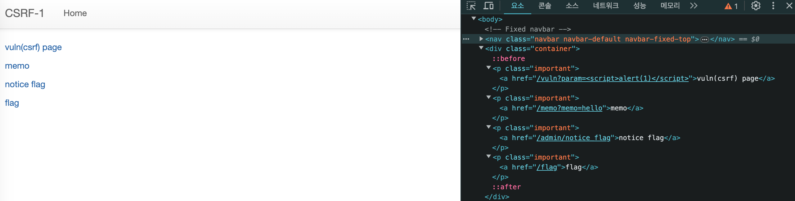

## 문제 설명
[26](https://dreamhack.io/wargame/challenges/26)

여러 기능과 입력받은 URL을 확인하는 봇이 구현된 서비스입니다.

CSRF 취약점을 이용해 플래그를 획득하세요.


## 정보
화면에서 알 수 있는 정보는 최소 4개의 페이지가 있다는 것이다.



- vuln(csrf) page 이동 시 쿼리 파라미터의 스크립트가 일부 치환된다.
- memo 이동 시 `/memo?memo=hello`에 명시된 쿼리 파라미터가 화면에 출력된다.
- memo 페이지는 반복 접근 시 로그와 같이 쿼리 파라미터의 값이 계속해서 쌓인다.
- notice flag 페이지 진입 시 200 OK가 떨어지지만 `text/html`로 'Access Denied'가 반환된다.
- flag 페이지에서는`POST /flag`로 form 데이터를 전송할 수 있다.

코드를 통해 각 페이지의 동작을 확인할 수 있다.

`/vuln` 페이지 접속 시 동작하는 코드는 아래와 같다.

```python
@app.route("/vuln")
def vuln():
    param = request.args.get("param", "").lower()
    xss_filter = ["frame", "script", "on"]
    for _ in xss_filter:
        param = param.replace(_, "*")
    return param
```

쿼리 파라미터 값을 모두 소문자로 변경하고 `xss_filter`에 포함된 문자열을 `*`로 치환한다. 그 외의 문자열은 그대로 반환해 `text/html` 형태로 응답한다.

`/flag` 페이지 접속 시 동작하는 코드는 아래와 같다.

```python
@app.route("/flag", methods=["GET", "POST"])
def flag():
    if request.method == "GET":
        return render_template("flag.html")
    elif request.method == "POST":
        param = request.form.get("param", "")
        if not check_csrf(param):
            return '<script>alert("wrong??");history.go(-1);</script>'

        return '<script>alert("good");history.go(-1);</script>'
```

GET 방식 요청의 경우 `flag.html` 파일을 렌더링해 응답하고, POST 방식 요청의 경우 `check_csrf()` 함수를 호출한다.

`check_csrf()` 함수는 다음과 같다.

```python
def check_csrf(param, cookie={"name": "name", "value": "value"}):
    url = f"http://127.0.0.1:8000/vuln?param={urllib.parse.quote(param)}"
    return read_url(url, cookie)
```

`/flag` 페이지에서 입력 받은 값을 쿼리 파라미터로 URL을 생성한다. `read_url()` 함수는 `url`과 `cookie` 두 개의 파라미터를 갖는데, `/flag` 페이지를 통해 `/vuln` 페이지에 접근하는 경우 쿠키 값은 디폴트 값으로 넘어간다.

`/admin/notice_flag` 페이지 접속 시 동작하는 코드는 아래와 같다.

```python
@app.route("/admin/notice_flag")
def admin_notice_flag():
    global memo_text
    if request.remote_addr != "127.0.0.1":
        return "Access Denied"
    if request.args.get("userid", "") != "admin":
        return "Access Denied 2"
    memo_text += f"[Notice] flag is {FLAG}\n"
    return "Ok"
```

`request.remote_addr`로 클라이언트의 요청 주소를 확인한다.

- 루프백으로부터 온 요청이 아닌 경우 'Access Denied'를 반환한다.
- 요청의 쿼리 파라미터가 'admin'이 아닌 경우 `Access Denied 2'를 반환한다.
- 그 외에는 `memo_text`에 플래그가 포함된 문자열을 할당하고 `OK`를 반환한다.


## 취약점
`memo_text`에 플래그 값이 저장될 가능성이 있음에도 변수가 전역으로 선언되어 `/admin/notice_flag`에 접근 권한이 없는 경우에도 로그를 확인할 수 있다. 서버가 동작하는 동안 `/admin/notice_flag` 페이지에 접근 가능한 사용자가 해당 페이지에 접속하면 플래그가 권한이 없는 사용자에게 노출될 가능성이 있다.

`/admin/notice_flag` 페이지는 기본적으로 루프백으로부터 온 요청이 아니면 접근을 거부하지만 이를 우회해 해당 페이지에 루프백으로 접근할 수 있다.


## 풀이
`memo_text`는 전역적으로 사용되는 변수이므로 위의 두 조건을 피해갈 수 있다면 `/admin/notice_flag`에 접근이 가능할 것이다


우선 루프백으로 해당 페이지에 접근하려면 어떻게 해야 할까? `/flag` 페이지를 통해 form 데이터를 전송하면 내부적으로 `check_csrf()` 함수를 타게 된다. 문제의 서버는 Selenium으로 특정 URL에 접근하는 봇이 구현되어 있다. 따라서 서버가 로컬(루프백)에서 `/admin/notice_flag` 페이지에 접근하도록 할 수 있다.

루프백이 아닌 외부의 사용자가 할 수 있는 것은 `/flag` 페이지에서 form 데이터를 전송해 이를 `/vuln` 페이지에 반영하는 것이다. Selenium으로 서버가 `/vuln` 페이지에 접근했을 때 DOM 요소 내에서 `GET /admin/notice_flag?userid=admin`으로 요청이 이루어지면 서버 측의 두 가지 방어 코드를 우회할 수 있다.

```html

```

기본적으로 DOM에 이미지 태그가 포함되면 브라우저는 해당 이미지의 `src` 속성에 지정된 URL로 GET 요청을 보낸다. 이 작업은 웹 페이지가 로드될 때 자동으로 일어난다. 따라서 서버의 봇이 `/vuln` 페이지에 접속함과 동시에 `GET /admin/notice_flag?userid=admin` 요청이 발생하고, 플래그는 `memo_text`에 저장되므로 CSRF 공격 성공 시 외부 사용자(공격자)는 `/memo` 페이지에서 플래그를 조회할 수 있다.
