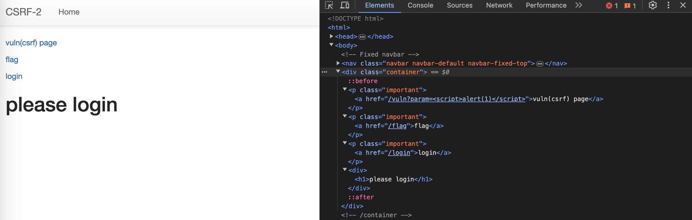

## 문제 설명
[269](https://dreamhack.io/wargame/challenges/269)

여러 기능과 입력받은 URL을 확인하는 봇이 구현된 서비스입니다.

CSRF 취약점을 이용해 플래그를 획득하세요.


## 정보
화면에서 알 수 있는 정보는 최소 3개의 페이지가 있다는 것이다.



- vuln(csrf) page 이동 시 쿼리 파라미터의 스크립트가 일부 치환된다.
- flag 페이지에서는`POST /flag`로 form 데이터를 전송할 수 있다.
- login 페이지에서는 `POST /login`으로 form 데이터를 전송할 수 있다.

코드를 통해 각 페이지의 동작을 확인할 수 있다.

우선 다음 두 객체는 전역에서 접근이 가능하다.

```python
users = {
    'guest': 'guest',
    'admin': FLAG
}

session_storage = {}
```

추측하자면 `session_storage`는 아마 서버측에서 관리하는 세션 정보 DB의 미니 버전인 것 같고, `users`는 유저 DB의 미니 버전인 것 같다. 물론 누구도 이렇게 데이터를 관리하지 않겠지만...

`GET /` 요청 시 동작하는 서버 측 코드는 다음과 같다.

```python
@app.route("/")
def index():
    session_id = request.cookies.get('sessionid', None)
    try:
        username = session_storage[session_id]
    except KeyError:
        return render_template('index.html', text='please login')

    return render_template('index.html', text=f'Hello {username}, {"flag is " + FLAG if username == "admin" else "you are not an admin"}')
```

클라이언트의 쿠키에서 `sessionid`를 가져온다. 서버 내부의 `session_storage`에서 저장된 세션 정보를 가져와 `username` 변수에 할당한다. `session_storage`는 서버에 전역으로 선언된 Dictionary다. `session_storage`에 저장된 `sessionid`가 없다면 `KeyError`를 던지고, `/` 페이지에서 'plase login' 텍스트가 출력된다.

만약 저장된 `sessionid`가 있는 경우 `/` 페이지에 `username`을 출력한다. 다만 `username == "admin"` 조건을 만족하는 경우에 플래그가 출력된다.

`GET /vuln` 요청 시 동작하는 서버 측 코드는 다음과 같다.

```python
@app.route("/vuln")
def vuln():
    param = request.args.get("param", "").lower()
    xss_filter = ["frame", "script", "on"]
    for _ in xss_filter:
        param = param.replace(_, "*")
    return param
```

쿼리 파라미터 값을 모두 소문자로 변경하고 `xss_filter`에 포함된 문자열을 `*`로 치환한다. 그 외의 경우, `text/html` 형태로 문자열을 반환한다.

`GET /flag`, `POST /flag` 요청 시 동작하는 서버 측 코드는 다음과 같다.

```python
@app.route("/flag", methods=["GET", "POST"])
def flag():
    if request.method == "GET":
        return render_template("flag.html")
    elif request.method == "POST":
        param = request.form.get("param", "")
        session_id = os.urandom(16).hex()
        session_storage[session_id] = 'admin'
        if not check_csrf(param, {"name":"sessionid", "value": session_id}):
            return '<script>alert("wrong??");history.go(-1);</script>'

        return '<script>alert("good");history.go(-1);</script>'
```

`GET /flag` 요청의 경우 `flag.html` 파일을 렌더링해 응답한다.

`POST /flag` 요청의 경우 쿼리 파라미터(`param`) 값으로 16바이트의 바이트 문자열을 생성한다. 생성된 바이트 객체를 16진수 문자열로 변환해 `session_id`에 할당한다. 이렇게 생성된 `session_id`는 `session_storage`에 저장된다. 생성된 16진수 문자열이 Key가 되고, 'admin`이 Value가 된다. 이후 `check_csrf()` 함수가 실행되고, 결과적으로 'admin' 유저의 `session_id`가 쿠키 값으로 넘어간다.

`check_csrf()` 함수는 다음과 같다.

```python
def check_csrf(param, cookie={"name": "name", "value": "value"}):
    url = f"http://127.0.0.1:8000/vuln?param={urllib.parse.quote(param)}"
    return read_url(url, cookie)
```

`/flag` 페이지에서 입력 받은 값을 쿼리 파라미터로 URL을 생성한다. `read_url()` 함수는 `url`과 `cookie` 두 개의 파라미터를 갖는데, `/flag` 페이지를 통해 `/vuln` 페이지에 접근하는 경우 쿠키 값은 디폴트 값으로 넘어간다.

`GET /login`, `POST /login` 요청 시 동작하는 서버 측 코드는 다음과 같다.

```python
@app.route('/login', methods=['GET', 'POST'])
def login():
    if request.method == 'GET':
        return render_template('login.html')
    elif request.method == 'POST':
        username = request.form.get('username')
        password = request.form.get('password')
        try:
            pw = users[username]
        except:
            return '<script>alert("not found user");history.go(-1);</script>'
        if pw == password:
            resp = make_response(redirect(url_for('index')) )
            session_id = os.urandom(8).hex()
            session_storage[session_id] = username
            resp.set_cookie('sessionid', session_id)
            return resp
        return '<script>alert("wrong password");history.go(-1);</script>'
```

`GET /login` 요청 시 `login.html` 파일을 렌더링해 응답한다.

`POST /login` 요청 시 사용자가 입력한 form 데이터로 로그인을 시도한다. 서버에서 관리하고 있는 `users`를 참조해 `username` Key로 접근 가능한 Value를 `pw`에 할당한다. 현재 서버에서 관리하고 있는 사용자는 'guest'와 'admin' 뿐이다.

다음으로 서버에 저장된 비밀번호 값과 유저가 입력한 `password` 값을 비교한다. 이 값이 일치하면 HTTP Response를 생성한다. `/` 페이지로 리다이렉션 처리하되, 8바이트 길이의 바이트 문자열을 생성하고 이를 16진수 문자열로 변환한다. 이 값은 `session_id`에 할당되고, 서버의 `session_storage`에 저장된다. `session_id` 값이 Key가 되고, 현재 로그인에 성공한 사용자의 `username`이 Value가 된다. 결과적으로 로그인에 성공한 클라이언트는 `sessionid`를 쿠키로 들고 있게 된다.

화면에서 확인할 수 없었지만 코드상에서 확인할 수 있는 다른 엔드포인트가 존재한다. `GET /change_password` 요청이 가능하다.

```python
@app.route("/change_password")
def change_password():
    pw = request.args.get("pw", "")
    session_id = request.cookies.get('sessionid', None)
    try:
        username = session_storage[session_id]
    except KeyError:
        return render_template('index.html', text='please login')

    users[username] = pw
    return 'Done'
```

코드를 보면 기본적으로 서버 측에 저장된 `session_storage`에 클라이언트의 쿠키 값(`session_id`)이 없으면 `/` 페이지로 보낸다. 로그인 되어 있는 유저(`session_id` 쿠키를 들고 있는 클라이언트)의 경우 요청 쿼리 파라미터로 받은 `pw` 값으로 비밀번호를 변경할 수 있다.


## 취약점
`POST /flag` 요청 시점에 'admin' 계정의 세션 정보가 생성되고 저장된다. 문제 서버의 취약점은 적절한 권한이 없는 유저가 세션 정보를 생성하고 저장하는 로직을 수행하는 요청에 접근할 수 있다는 것이다. 로그인을 하지 않은 경우에도 `POST /flag` 요청 시 서버 측에 세션 정보가 생성되고 저장된다.

`/change_password` 페이지에서 비밀번호를 변경할 때, 클라이언트 쿠키에 저장된 세션 아이디로만 현재 요청을 보낸 사용자를 식별하고 있다. 비밀번호 변경 시 비밀번호를 재확인하는 등의 방어 로직이 없으므로, 이 경우 세션 아이디가 노출되면 누구든 비밀번호를 변경할 수 있다.


## 풀이
`POST /flag`로 form 데이터를 전송하면 서버는 Selenium으로 `/vuln` 페이지에 접속한다. `/vuln` 페이지 접속 시점에 서버는 `session_storage`에 Value가 'admin'인 세션 정보를 가지고 있게 된다. 이 때 `check_csrf()` 함수가 호출되면서 생성된 세션 아이디는 클라이언트 쿠키로 저장된다. 따라서 `/vuln` 페이지에서 `/change_password`에 GET 요청을 하면 클라이언트가 들고 있는 쿠키(세션 아이디) 정보에 해당 하는 사용자의 비밀번호를 변경하게 된다.

```html

```

`/vuln` 페이지에 위의 태그가 포함되면 이미지를 가져오기 위해 브라우저는 `GET /change_password?pw=admin`으로 요청을 보내게 된다. 이 때 요청을 보내는 클라이언트의 쿠키(`sessionid`)는 서버의 `session_storage`에 저장된 'admin' 사용자를 의미하므로 'admin' 사용자의 비밀번호를 변경할 수 있다.

CSRF 공격이 성공하면 `/login` 페이지에서 admin 계정으로 로그인할 수 있고, `/` 페이지에 플래그가 노출된다.

