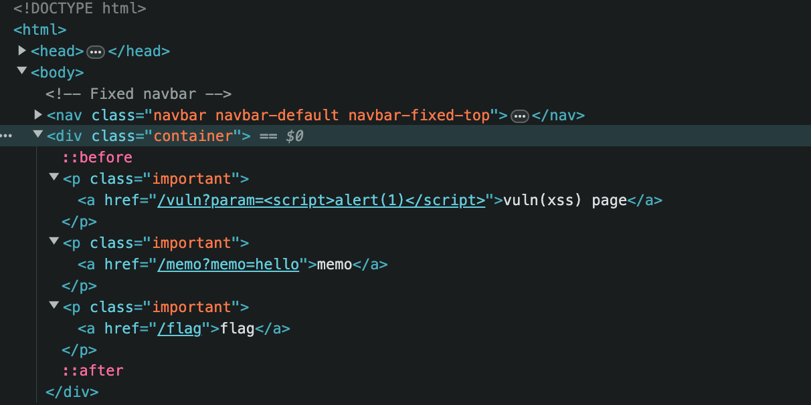

## 문제 설명

여러 기능과 입력받은 URL을 확인하는 봇이 구현된 서비스입니다.

XSS 취약점을 이용해 플래그를 획득하세요. 플래그는 `flag.txt`, FLAG 변수에 있습니다.

플래그 형식은 `DH{...}` 입니다.


## 정보

화면에서 알 수 있는 정보는 최소 3개의 페이지가 있다는 것이다.



- vuln(xss) page 이동 시 `<script>alert(1)</script>`가 실행된다.
- memo 이동 시 `/memo?memo=hello`에 명시된 파라미터가 출력된다.
- memo 페이지는 반복 접근 시 로그와 같이 파라미터 내용이 계속해서 쌓인다.
- flag 페이지의 form은 `POST /flag`로 text 값을 전송한다.

코드를 통해 각 페이지에서 어떤 로직이 동작하는지 확인할 수 있다.

먼저 `/vuln` 페이지 접속 시 동작은 다음과 같다.

```python
@app.route("/vuln")
def vuln():
    param = request.args.get("param", "")
    return param
```

쿼리 파라미터에 들어오는 모든 문자열은 별다른 필터링 없이 그대로 `Content-Type: text/html` 형태로 반환된다. 따라서 `param`의 값에 스크립트 코드가 있는 경우 이는 그대로 브라우저에서 실행된다.

`/flag` 페이지 접속 시 동작은 다음과 같다.

```python
@app.route("/flag", methods=["GET", "POST"])
def flag():
    if request.method == "GET":
        return render_template("flag.html")
    elif request.method == "POST":
        param = request.form.get("param")
        if not check_xss(param, {"name": "flag", "value": FLAG.strip()}):
            return '<script>alert("wrong??");history.go(-1);</script>'

        return '<script>alert("good");history.go(-1);</script>'
```

GET 방식 요청인 경우 `flag.html` 페이지를 렌더링하고, POST 요청인 경우 `check_xss()`를 실행한다. 함수 실행 시점에서 `./flag.txt` 파일의 내용이 인자로 전달된다.

`check_xss()` 함수는 다음과 같다.

```python
def check_xss(param, cookie={"name": "name", "value": "value"}):
    url = f"http://127.0.0.1:8000/vuln?param={urllib.parse.quote(param)}"
    return read_url(url, cookie)
```

`/flag` 페이지에서 입력 받은 값을 쿼리 파라미터로 삽입해 `/vuln` 페이지에 접근한다. `read_url()` 함수는 Selenium으로 해당 주소에 접근하고, 파라미터로 받은 쿠키 값을 삽입한다.


## 취약점

`/vuln` URL의 쿼리 파라미터에 스크립트 필터가 없고, 파라미터 값을 `text/html` 형식으로 반환하므로 서버 응답에 스크립트 삽입이 가능하다.

## 풀이

`/flag` 페이지를 통해 `/vuln` 페이지에 접근할 때 플래그가 쿠키로 저장된다. 따라서 `/vuln` 페이지에 접근했을 때의 쿠키 값을 `/memo` 페이지에 노출시키는 방법을 생각해볼 수 있다.

`/flag` 페이지의 form 입력으로 스크립트 코드를 입력하면, 이는 `/vuln` URL의 쿼리 파라미터로 들어간다. `/vuln` URL에는 사용자 입력에 대한 별다른 방어 코드가 없으므로 이 스크립트 코드는 그대로 실행될 것이다. 만약 `<script>document.cookie;</script>`를 `POST /flag`로 전송하면 `/vuln` 페이지에 접속했을 때 가지고 있는 쿠키를 반환할 것이다. 다만 쿠키 값을 눈으로 확인하기 위해서는 `/memo` 페이지를 이용할 수 있다.

`/vuln` 페이지에서 가져온 쿠키 값을 `/memo` 페이지에서 확인하려면 어떻게 해야 할까?

```javascript
location.href='/memo?memo=' + document.cookie;
```

이 스크립트가 `/vuln` 페이지에서 실행되도록 하면 Selenium으로 `/vuln` 페이지에 접속했을 때 삽입된 쿠키가 `/memo` 페이지의 쿼리 파라미터로 전송된다.

