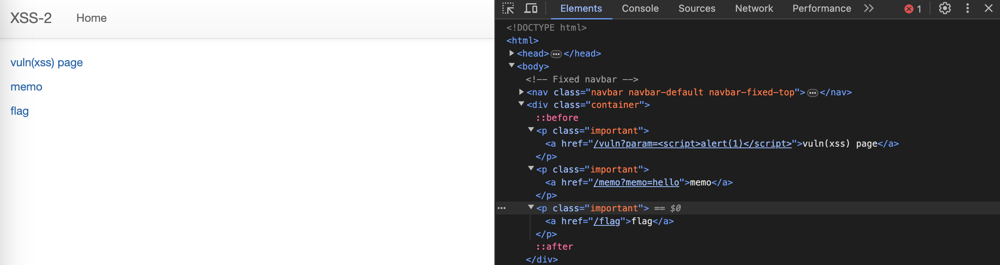
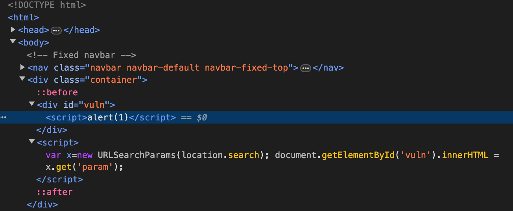

## 문제 설명

[268](https://dreamhack.io/wargame/challenges/268)

여러 기능과 입력받은 URL을 확인하는 봇이 구현된 서비스입니다.

XSS 취약점을 이용해 플래그를 획득하세요. 플래그는 `flag.txt`, FLAG 변수에 있습니다.

플래그 형식은 `DH{...}` 입니다.


## 정보
화면에서 알 수 있는 정보는 최소 3개의 페이지가 있다는 것이다.



- vuln(xss) page 이동 시 쿼리 파라미터의 스크립트 코드는 실행되지 않는다.
- memo 이동 시 `/memo?memo=hello`에 명시된 쿼리 파라미터의 값이 출력된다.
- memo 페이지는 반복 접근 시 로그와 같이 쿼리 파라미터의 값이 계속해서 쌓인다.
- flag 페이지의 form은 `POST /flag`로 요청을 보낸다.

코드를 통해 각 페이지의 동작을 확인할 수 있다.

`/vuln` 페이지 접속 시 동작은 다음과 같다.

```python
@app.route("/vuln")
def vuln():
    return render_template("vuln.html")
```
화면에서 확인했을 때는 쿼리 파라미터를 받고 있었는데, 쿼리 파라미터에 대한 별다른 조치 없이 `vuln.html` 파일을 그대로 렌더링 처리하고 있다. `vuln.html` 파일을 확인하면 다음과 같은 스크립트가 삽입되어 있는 것을 볼 수 있다.

```html
<script>var x=new URLSearchParams(location.search); document.getElementById('vuln').innerHTML = x.get('param');</script>
```

서버로부터 `vuln.html` 파일을 렌더링한 후 스크립트가 실행되면서 현재 URL의 쿼리 파라미터 부분을 `innerHTML`로 요소에 삽입하고 있다.



그래서 서버 측에서 따로 방어 코드를 작성하지 않아도 `/vuln` 페이지에서는 스크립트가 실행되지 않는다. HTML5에서는 `innerHTML`로 삽입된 `<script>` 태그는 실행되지 않도록 지정하기 때문이다. ([참고](https://developer.mozilla.org/en-US/docs/Web/API/Element/innerHTML#security_considerations))

`/flag` 페이지 접속 시 동작은 다음과 같다.

```python
@app.route("/flag", methods=["GET", "POST"])
def flag():
    if request.method == "GET":
        return render_template("flag.html")
    elif request.method == "POST":
        param = request.form.get("param")
        if not check_xss(param, {"name": "flag", "value": FLAG.strip()}):
            return '<script>alert("wrong??");history.go(-1);</script>'

        return '<script>alert("good");history.go(-1);</script>'
```

GET 방식 요청의 경우 `flag.html` 파일을 렌더링하고, POST 방식 요청의 경우 `check_xss()` 함수를 실행한다. 함수 실행 시점에 `./flag.txt` 파일의 내용이 인자로 전달된다.

`check_xss()` 함수는 다음과 같다.

```python
def check_xss(param, cookie={"name": "name", "value": "value"}):
    url = f"http://127.0.0.1:8000/vuln?param={urllib.parse.quote(param)}"
    return read_url(url, cookie)
```

`/flag` 페이지에서 입력 받은 값을 `/vuln` URL의 쿼리 파라미터로 사용한다. `read_url()` 함수는 Selenium으로 `url`에 접근하고, 쿠키를 설정한다.


## 취약점
`/vuln` URL의 쿼리 파라미터에 대한 방어 코드가 서버 측에 존재하지 않고 HTML5에서 지원하는 `innerHTML`의 기본적인 방어에 의존하고 있다. `innerHTML`로 쿼리 파라미터의 값을 DOM 요소 내에 삽입하고 있으므로 입력값이 DOM에 포함될 가능성이 있다. `<script>`를 사용하지 않고 JavaScript를 실행할 수 있으므로 이 부분이 취약하다.


## 풀이
`<script>`를 사용하지 않고 JavaScript를 실행하려면 어떻게 해야 할까? `innerHTML`로 삽입할 수 있는 DOM Element를 통해 스크립트를 실행할 수 있다.

```html

```
만약 위의 이미지 태그가 DOM에 삽입된다면 이미지를 불러오는 데 실패할 것이고, `onerror`에 지정한 스크립트가 실행될 것이다.

`/flag` 페이지를 통해 `/vuln` 페이지에 접속할 때 플래그가 쿠키에 저장된다. 따라서 이 시점에 스크립트를 실행할 수 있다면 `/memo` 페이지에  해당 쿠키 값을 기록할 수 있을 것이다.

```html

```
